---

<p align="center">
  <h1 align="center">💀 Hacker_AI Autonomous Cyberwarfare Platform 💀</h1>
  <h3 align="center"><code>Developed by Bhanu Guragain (Shadow@Bh4nu) | BSc Ethical Hacking & Cybersecurity, Coventry University</code></h3>
</p>

<div align="center">
  <pre style="display: inline-block; color: green;">
 ██╗  ██╗ █████╗  ██████╗██╗  ██╗███████╗██████╗       █████╗ ██╗
 ██║  ██║██╔══██╗██╔════╝██║ ██╔╝██╔════╝██╔══██╗     ██╔══██╗██║
 ███████║███████║██║     █████╔╝ █████╗  ██████╔╝     ███████║██║
 ██╔══██║██╔══██║██║     ██╔═██╗ ██╔══╝  ██╔══██╗     ██╔══██║██║
 ██║  ██║██║  ██║╚██████╗██║  ██╗███████╗██║  ██║████╗██║  ██║██║
 ╚═╝  ╚═╝╚═╝  ╚═╝ ╚═════╝╚═╝  ╚═╝╚══════╝╚═╝  ╚═╝╚═══╝╚═╝  ╚═╝╚═╝
  </pre>
</div>

<p align="center">
  <a href="https://github.com/BhanuGuragain0/Hacker_AI/actions/workflows/ci.yml">
    
  </a>
  <a href="https://github.com/BhanuGuragain0/Hacker_AI/blob/main/LICENSE">
    
  </a>
  <a href="https://github.com/BhanuGuragain0/Hacker_AI/releases/latest">
    
  </a>
  <a href="https://github.com/BhanuGuragain0/Hacker_AI/stargazers">
    
  </a>
</p>

<p align="center" style="font-family: 'Courier New', monospace; color: #FF4500;">
  <em>
    Forged in the shadows of Coventry University’s Cyber Lab ⚡, <strong>Hacker_AI</strong> is the ultimate red team weapon. Packing 3,200+ Kali Linux tools, quantum-hardened defenses, and self-evolving AI agents, it’s built to dominate XDR, SIEM, EDR, and PQC systems with ruthless precision. Victory or death there’s no middle ground.
  </em>
</p>

---

## 📖 Introduction

**Overview**: Hacker_AI is a next-generation autonomous cyberwarfare platform crafted for elite red team operators and cutting-edge researchers. Born in Coventry University’s Cyber Lab, it fuses over 3,200 Kali Linux tools with advanced AI models and quantum simulation capabilities. Its modular architecture spanning over two million lines of production-grade code delivers undetectable operations, quantum-grade resilience, and AI-driven precision to dismantle advanced persistent threats (APTs), nation-state actors, and post-quantum defenses (PQC).

- **Red Team Edge**: Polymorphic payloads, quantum-secure C2, and zero-day exploit generation.
- **Scale**: Over 19 specialized AI agents, 32B+ parameter models, and a swarm-based attack engine.

---

## 🎯 Mission & Vision

**Mission**: To forge an AI-driven, quantum-secured arsenal that achieves total cyber dominance, shattering modern defenses with surgical precision.

**Vision**: To lead the red team revolution, where autonomous systems evolve faster than zero-days can be patched, securing digital supremacy for ethical hackers.

- 🕵️‍♂️ **Zero-Latency Threat Hunting**: Autonomous ops with no human delay
- 🔐 **Quantum-Grade Defenses**: Kyber-1024 + AES-256-GCM encryption
- 🧠 **Self-Evolving AI**: 32B+ parameter agents that learn and adapt
- 💻 **Multi-Vector Control**: CLI, Web UI, Voice, and API interfaces

### Red Team Manifesto
Hacker_AI is a declaration of war on digital complacency. We demand:
- 🚀 **Code Beyond Limits**: Shatter conventional boundaries
- 🤖 **Autonomous Supremacy**: Self-adapting, no human crutches
- 🕶️ **Ghost Operations**: Quantum evasion, unbreakable stealth
- ⚡ **Lethal Efficiency**: Maximum impact, minimal footprint
- 🔒 **Iron Resilience**: Post-quantum security, self-healing architecture

---

## 🔥 Features

### Key Features
- **Quantum-Resistant Cryptography**: Unbreakable encryption via `hacker_ai/backend/quantum/kyber_vault.py`
- **AI-Driven Orchestration**: Strategic ops with `hacker_ai/backend/core/orchestration/orchestration_engine.py`
- **Self-Healing System**: Auto-recovery in `hacker_ai/backend/core/self_healing/self_heal_system.py`
- **Zero-Trust Architecture**: Continuous validation via `hacker_ai/backend/core/security/zero_trust_verifier.py`
- **Agent Framework**: Modular agents in `hacker_ai/backend/agents/base_agent.py`
- **Interfaces**: CLI (`hacker_ai/frontend/cli/main_cli.py`), GUI (`hacker_ai/frontend/gui/main_window.py`), API (`hacker_ai/backend/api/api_server.py`)

### Signature Capabilities
| **Category**      | **🔥 Red Team Edge**                              | **Tech Specs**                      |
|-------------------|---------------------------------------------------|-------------------------------------|
| **AI Arsenal**    | Autonomous zero-day generation                    | PyTorch + CUDA 12.x                |
| **Quantum Ops**   | Unbreakable C2 channels                           | Qiskit + Kyber-1024                |
| **Ghost Mode**    | Memory-only execution                             | eBPF + ROP chains                  |
| **Neural Recon**  | Darkweb intel harvesting                          | NLP + Graph Neural Networks        |
| **Voice Control** | Natural language attack triggers                  | Qwen2-Audio-7B                     |

### Core Capabilities
- **💣 AI-Driven Offensive Suite**:
  - 3,200+ tools orchestrated via `hacker_ai/infrastructure/tools/tool_orchestrator.py`
  - Exploit generation with `hacker_ai/backend/core/model_serving/deepseek_coder_v2_lite_instruct/deepseek_coder.py`
  - Real-time chaining via `hacker_ai/backend/ai/exploitation/exploit_chainer.py`
- **🔒 Quantum-Secure Infrastructure**:
  - C2 channels in `hacker_ai/backend/quantum/quantum_c2.py`
  - Lattice-based encryption via `hacker_ai/backend/quantum/kyber_vault.py`
- **🕶️ Stealth Operations**:
  - Polymorphic payloads from `hacker_ai/backend/ai/stealth/polymorphic_rootkit_generator.py`
  - Anti-forensic ops in `hacker_ai/backend/ai/stealth/anti_forensic_ml.py`
- **🧠 Adaptive Intelligence**:
  - Federated learning via `hacker_ai/backend/ai/trainers/federated.py`
  - MITRE ATT&CK tactics in `hacker_ai/backend/ops/red_team/threat_simulation.py`

### Reconnaissance Features
- **⚡ Parallel Scanning**: Multi-threaded ops in `hacker_ai/backend/agents/agent_reconnaissance.py`
- **🛡️ Rate Limiting**: Controlled via `hacker_ai/backend/api/middleware/rate_limiter.py`
- **💾 Smart Caching**: TTL-based in `hacker_ai/backend/cache/redis_client.py`
- **🧠 AI Analysis**: Risk scoring in `hacker_ai/backend/ai/vulnerability/vuln_classifier.py`
- **🚨 Error Handling**: Robust fallbacks in `hacker_ai/exceptions/general_exceptions.py`
- **📈 Performance Metrics**: Tracked via `hacker_ai/utils/metrics_collector.py`

---

## 🛠 System Architecture

Hacker_AI’s architecture is a red team masterpiece modular, scalable, and relentless:

- **QwQ_32B AI Engine**: Core brain in `hacker_ai/backend/core/model_serving/qwq_32b/qwq_32b.py`
- **Quantum Environment**: Entropy via `hacker_ai/backend/quantum/quantum_entropy_generator.py`
- **Specialized Agents**: Modular ops in `hacker_ai/backend/agents/base_agent.py`
- **Self-Healing System**: Resilience in `hacker_ai/backend/core/self_healing/self_heal_system.py`
- **Zero-Trust Verifier**: Security in `hacker_ai/backend/core/security/zero_trust_verifier.py`

### Technical Stack
- **AI/ML Stack**:
  - **Core Models**: Gemma 3 (`hacker_ai/backend/core/model_serving/gemma_3/gemma_3.py`), QWQ-32B, Openthinker 7B/32B
  - **Frameworks**: PyTorch (CUDA 12.x), TensorFlow Quantum
  - **Quantum**: Qiskit in `hacker_ai/backend/quantum/quantum_env/qiskit_simulator.py`
- **Backend**:
  - **Orchestration**: FastAPI (`hacker_ai/backend/api/api_server.py`), Kafka (`hacker_ai/backend/messaging/kafka_handler.py`)
  - **Database**: Redis (`hacker_ai/backend/cache/redis_client.py`), PostgreSQL (`hacker_ai/data/db/database.py`)
  - **Security**: eBPF in `hacker_ai/backend/core/security/ebpf_monitor.py`
- **Deployment**:
  - **Containerization**: Docker (`hacker_ai/infrastructure/deployment/docker/Dockerfile`)
  - **Orchestration**: Kubernetes (`hacker_ai/infrastructure/deployment/kubernetes/k8s_config.yaml`)
  - **Monitoring**: Prometheus (`hacker_ai/infrastructure/monitoring/prometheus.yml`)

### Reconnaissance Components
- **ReconnaissanceAgent**: Scans via `hacker_ai/backend/agents/agent_reconnaissance.py`
- **ReconAnalysisModel**: Analyzes in `hacker_ai/backend/models/recon_analysis_model.py`
- **AgentInitializer**: Setup in `hacker_ai/backend/agents/agent_initialization.py`
- **ConfigLoader**: Loads via `hacker_ai/utils/config_loader.py`
- **Logger**: Audits in `hacker_ai/utils/logger.py`

---

## 📂 PROJECT STRUCTURE 🧠💀

<details>
<summary>Expand to View Full Structure</summary>
  
```bash
🌐 **hacker_ai**  
• An AI-forged, quantum-secured offensive and defensive cybersecurity platform designed to neutralize modern defenses (XDR, SIEM, EDR, PQC) and achieve total digital supremacy.

├── ⚙️ **backend**  
│   • The core engine powering autonomous AI operations, APIs, caching, and red team orchestration built for relentless execution.  
│   ├── 🤖 **agents**  
│   │   • Autonomous AI agents executing polymorphic, self-adaptive tasks reconnaissance, exploitation, and stealth across diverse domains.  
│   ├── 🧠 **ai**  
│   │   • ML-guided exploit generation and precision vulnerability analysis driving the evolution of next-gen cyberweapons.  
│   │   ├── 🔥 **adversarial**  
│   │   │   • Adversarial AI tools to shatter defensive systems with polymorphic payloads and evasion tactics.  
│   │   │   ├── 🛡️ **evasion**  
│   │   │   │   • Self-obfuscating evasion engines to bypass XDR/EDR.  
│   │   │   ├── 🧪 **fuzzing**  
│   │   │   │   • AI-driven fuzzing to expose hidden vulnerabilities.  
│   │   │   └── 💣 **zero_day**  
│   │   │       • Quantum-enhanced zero-day exploit synthesis.  
│   │   ├── 💰 **bug_bounty**  
│   │   │   • Automated bug bounty hunting with real-time reporting.  
│   │   ├── 🎭 **deepfake**  
│   │   │   • Deepfake generation and detection for psyops and counterintelligence.  
│   │   ├── 📚 **deep_learning**  
│   │   │   • Core deep learning frameworks for autonomous adaptation.  
│   │   ├── 🛡️ **defensive**  
│   │   │   • Defensive AI countermeasures to neutralize threats.  
│   │   │   ├── 🍯 **honeytokens**  
│   │   │   │   • Deceptive traps to ensnare attackers.  
│   │   │   ├── 🕵️ **malware_analysis**  
│   │   │   │   • Behavioral and static malware dissection.  
│   │   │   └── 🎯 **threat_hunting**  
│   │   │       • Proactive threat hunting with global intel fusion.  
│   │   ├── 📖 **explainability**  
│   │   │   • AI decision transparency tools.  
│   │   ├── ⚔️ **exploitation**  
│   │   │   • Exploit chaining and optimization.  
│   │   ├── 🦠 **malware**  
│   │   │   • Quantum-entangled malware evolution.  
│   │   ├── 🗃️ **models**  
│   │   │   • Repository of battle-tested AI models.  
│   │   │   └── 🔍 **vulnerability**  
│   │   │       • Precision vuln analysis.  
│   │   ├── 📜 **model_versioning**  
│   │   │   • Dynamic model lifecycle management.  
│   │   ├── ⚡ **optimization**  
│   │   │   • Quantum-accelerated model optimization.  
│   │   ├── 🔮 **prediction**  
│   │   │   • Predictive analytics for preemptive strikes.  
│   │   ├── 📉 **quantization**  
│   │   │   • Model compression for rapid deployment.  
│   │   ├── 🕵️‍♂️ **reconnaissance**  
│   │   │   • AI-driven recon orchestration.  
│   │   ├── 🎮 **reinforcement**  
│   │   │   • RL-based attack simulation.  
│   │   ├── 🔒 **safety**  
│   │   │   • Ethical AI safeguards.  
│   │   ├── 🕶️ **stealth**  
│   │   │   • Quantum-stealth C2 and rootkit generation.  
│   │   ├── 🐝 **swarm**  
│   │   │   • Swarm intelligence for multi-agent dominance.  
│   │   ├── 🏋️ **trainers**  
│   │   │   • Adaptive training frameworks.  
│   │   └── 🚀 **training_pipeline**  
│   │       • Self-reconfigurable training pipelines.  
│   ├── 🌐 **api**  
│   │   • RSA-encrypted API for secure command execution.  
│   │   ├── 🛠️ **middleware**  
│   │   │   • Secure request processing.  
│   │   └── 📡 **v1**  
│   │       • Versioned API endpoints.  
│   │       ├── ⚔️ **exploit**  
│   │       │   • Exploit delivery endpoints.  
│   │       └── 🧠 **intelligence**  
│   │           • OSINT and threat intel endpoints.  
│   ├── 💾 **cache**  
│   │   • High-speed caching for operational efficiency.  
│   ├── ✅ **compliance**  
│   │   • Ethical and regulatory enforcement.  
│   ├── 🔧 **core**  
│   │   • Foundational architecture for autonomous execution.  
│   │   ├── 📡 **c2_server**  
│   │   │   • Decentralized, quantum-secured C2.  
│   │   ├── 🗃️ **models**  
│   │   │   • Structured data models.  
│   │   ├── 🚀 **model_serving**  
│   │   │   • Dynamic model deployment.  
│   │   │   ├── *deepseek_coder_v2_lite_instruct***  
│   │   │   │   • Lightweight coding model.  
│   │   │   ├── *gemma_3***  
│   │   │   │   • General-purpose AI model.  
│   │   │   ├── *janus_pro_7b***  
│   │   │   │   • 7B parameter exploit model.  
│   │   │   ├── *kokoro_82m***  
│   │   │   │   • 82M parameter TTS model.  
│   │   │   ├── *openthinker_32b***  
│   │   │   │   • 32B parameter reasoning model.  
│   │   │   ├── *openthinker_7b***  
│   │   │   │   • 7B parameter lightweight model.  
│   │   │   ├── *pre_trained_models***  
│   │   │   │   • Pre-trained arsenal.  
│   │   │   ├── *qwen2_5_vl_7b_instruct***  
│   │   │   │   • Vision-language model.  
│   │   │   ├── *qwen2_audio_7b_instruct***  
│   │   │   │   • Audio deepfake model.  
│   │   │   ├── *qwq_32b***  
│   │   │   │   • 32B parameter specialized model.  
│   │   │   ├── *securityllm***  
│   │   │   │   • Security-focused LLM.  
│   │   │   └── *triton***  
│   │   │       • High-performance inference.  
│   │   ├── 🎼 **orchestration**  
│   │   │   • Multi-vector attack coordination.  
│   │   │   └── ⛓️ **exploit_chaining**  
│   │   │       • Exploit sequence automation.  
│   │   ├── 🔒 **security**  
│   │   │   • Quantum-hardened security layer.  
│   │   │   ├── 🚪 **access**  
│   │   │   │   • Zero-trust access control.  
│   │   │   ├── 🕵️ **anti_forensics**  
│   │   │   │   • Forensic trace erasure.  
│   │   │   ├── 🔐 **anti_tamper**  
│   │   │   │   • Tamper-proofing.  
│   │   │   ├── 📋 **audit**  
│   │   │   │   • Security auditing.  
│   │   │   ├── 🏰 **component_sandbox**  
│   │   │   │   • Isolated component execution.  
│   │   │   ├── 🔑 **crypto**  
│   │   │   │   • Post-quantum encryption.  
│   │   │   ├── 🏠 **enclaves**  
│   │   │   │   • Secure enclaves.  
│   │   │   ├── 🔧 **hsm**  
│   │   │   │   • Hardware security integration.  
│   │   │   └── 📜 **model_governance**  
│   │   │       • AI ethics and lifecycle.  
│   │   ├── 🩺 **self_healing**  
│   │   │   • Predictive self-repair.  
│   │   └── 📅 **tasks**  
│   │       • Task scheduling for AI ops.  
│   ├── ⚔️ **ops**  
│   │   • Red and blue team operational supremacy.  
│   │   ├── ⛓️ **attack_chains**  
│   │   │   • Automated attack sequences.  
│   │   ├── 🛡️ **blue_team**  
│   │   │   • Defensive simulations.  
│   │   │   ├── 🚨 **incident_response**  
│   │   │   │   • Auto-patching and evasion.  
│   │   │   └── 🧠 **threat_intel**  
│   │   │       • Cyber deception and intel.  
│   │   ├── 🏆 **ctf**  
│   │   │   • CTF challenge automation.  
│   │   └── 🔥 **red_team**  
│   │       • Red team AI arsenal.  
│   ├── ⚛️ **quantum**  
│   │   • Quantum-enhanced attack and defense.  
│   │   └── 🌐 **quantum_env**  
│   │       • Quantum simulation env.  
│   ├── 🔍 **scanning**  
│   │   • Network scanning and analysis.  
│   └── 🎯 **strategies**  
│       • Game theory and quantum entropy strategies.  
├── 📊 **benchmarks**  
│   • Performance and stealth benchmarks.  
├── ⚙️ **config**  
│   • Secure runtime and deployment configs.  
├── 💾 **data**  
│   • Centralized data fortress for exploits and intel.  
│   ├── 🔄 **backup**  
│   │   • Data resilience tools.  
│   ├── 📜 **consent_db**  
│   │   • Compliance consent management.  
│   ├── 🐞 **cve**  
│   │   • CVE analysis and import.  
│   ├── 📚 **datasets**  
│   │   • Training and testing datasets.  
│   │   ├── 🔒 **encrypted**  
│   │   │   • Secure dataset storage.  
│   │   ├── *openthoughts_114k***  
│   │   │   • 114k-entry dataset for AI training.  
│   │   │   ├── 📊 **data**  
│   │   │   │   • Raw training data.  
│   │   │   ├── 📝 **metadata**  
│   │   │   │   • Dataset metadata.  
│   │   │   └── 📜 **provenance**  
│   │   │       • Data lineage tracking.  
│   │   └── 📂 **raw**  
│   │       • Unprocessed data.  
│   ├── 🗄️ **db**  
│   │   • Database management.  
│   ├── ⚔️ **exploits**  
│   │   • Exploit storage and validation.  
│   ├── 🚚 **migrations**  
│   │   • DB schema migrations.  
│   ├── 💣 **payloads**  
│   │   • Payload generation.  
│   ├── 🚀 **pipeline**  
│   │   • Data ingestion and processing.  
│   ├── 🧠 **threat_intel**  
│   │   • Global threat feeds.  
│   └── 📖 **wordlists**  
│       • Brute-force and recon wordlists.  
├── 📜 **docs**  
│   • Battle-tested documentation.  
├── 🚨 **exceptions**  
│   • Custom error handling for resilience.  
├── 🖥️ **frontend**  
│   • Interfaces for commanding the arsenal.  
│   ├── ⌨️ **cli**  
│   │   • CLI control center.  
│   │   ├── 🛠️ **other_clis**  
│   │   │   • Utility CLIs.  
│   │   └── ⚙️ **tool_clis**  
│   │       • Tool-specific CLIs.  
│   ├── 🖼️ **gui**  
│   │   • Visual command interface.  
│   └── 🌐 **web_ui**  
│       • Web-based C2 interface.  
│       ├── 🌐 **api**  
│       │   • Web API endpoints.  
│       ├── 🧩 **components**  
│       │   • Reusable UI components.  
│       ├── 📜 **js**  
│       │   • Client-side logic.  
│       ├── 🎨 **styles**  
│       │   • CSS for stealth and usability.  
│       └── 🖌️ **templates**  
│           • HTML templates.  
├── 🐙 **.github**  
│   • GitHub automation and governance.  
│   └── ⚙️ **workflows**  
│       • CI/CD pipelines.  
├── 🏗️ **infrastructure**  
│   • Self-reconfigurable deployment architecture.  
│   ├── 🚀 **deployment**  
│   │   • Deployment orchestration.  
│   │   ├── 🐳 **docker**  
│   │   │   • Containerized deployment.  
│   │   └── ☸️ **kubernetes**  
│   │       • K8s orchestration.  
│   ├── 📈 **monitoring**  
│   │   • Real-time system health.  
│   ├── 🔒 **secrets**  
│   │   • Secure credential vault.  
│   │   └── 🏦 **vault**  
│   │       • Encrypted secrets.  
│   └── 🛠️ **tools**  
│       • External tool integrations.  
│       ├── ☁️ **cloud**  
│       │   • Cloud provider wrappers.  
│       ├── 🔐 **crypto_stego**  
│       │   • Crypto and stego tools.  
│       ├── 🗄️ **database**  
│       │   • DB attack tools.  
│       ├── 🛡️ **evasion**  
│       │   • Evasion wrappers.  
│       ├── ⚔️ **exploitation**  
│       │   • Exploit tool integrations.  
│       ├── 🧪 **fuzzing**  
│       │   • Fuzzing wrappers.  
│       ├── 🎮 **gpu**  
│       │   • GPU-accelerated tools.  
│       ├── 💻 **hardware**  
│       │   • Hardware attack tools.  
│       ├── 🕵️ **identify**  
│       │   • System ID tools.  
│       ├── 📡 **information_gathering**  
│       │   • Recon tools.  
│       ├── 📱 **iot**  
│       │   • IoT security tools.  
│       ├── 🛠️ **other_tools**  
│       │   • Misc integrations.  
│       ├── 🔑 **passwords**  
│       │   • Password cracking.  
│       ├── 🏃 **post_exploitation**  
│       │   • Post-exploit tools.  
│       ├── 🔄 **recovery**  
│       │   • Recovery tools.  
│       ├── 🔧 **reverse_engineering**  
│       │   • RE tools.  
│       ├── 📟 **rfid**  
│       │   • RFID tools.  
│       ├── 📡 **sdr**  
│       │   • SDR tools.  
│       ├── 📱 **smartphones**  
│       │   • Mobile security.  
│       ├── 👃 **sniffing_spoofing**  
│       │   • Network spoofing.  
│       ├── 🎭 **social_engineering**  
│       │   • SE frameworks.  
│       ├── 🖥️ **tool_interface**  
│       │   • Tool integration hub.  
│       ├── 📞 **voip**  
│       │   • VoIP tools.  
│       ├── 🐞 **vulnerability**  
│       │   • Vuln scanning.  
│       ├── 🌐 **web**  
│       │   • Web attack tools.  
│       └── 📶 **wireless**  
│           • Wireless tools.  
├── 🤖 **jarvis**  
│   • AI-driven assistant for operational control.  
├── 🔌 **plugins**  
│   • Extensible plugin system.  
│   └── 🛠️ **tools_plugin**  
│       • Tool integration plugins.  
├── 🏖️ **sandbox**  
│   • Isolated testing ground.  
├── 📜 **scripts**  
│   • Automation scripts.  
├── 🧪 **tests**  
│   • Battle-tested validation suites.  
│   ├── 🔥 **adversarial**  
│   │   • Adversarial robustness tests.  
│   ├── ✅ **compliance**  
│   │   • Compliance validation.  
│   ├── 🧫 **experimental**  
│   │   • Experimental tests.  
│   ├── 🔗 **integration**  
│   │   • Interoperability tests.  
│   ├── 📈 **performance**  
│   │   • Performance benchmarks.  
│   ├── ⚛️ **quantum**  
│   │   • Quantum operation tests.  
│   ├── 🔒 **security**  
│   │   • Security validation.  
│   └── 🕶️ **stealth**  
│       • Stealth operation tests.  
├── 🛠️ **tools**  
│   • Standalone tool management.  
├── 🧰 **utils**  
│   • Utility arsenal for data and network ops.  
│   ├── 📊 **data**  
│   │   • Data processing tools.  
│   └── 🌐 **network**  
│       • Network ops.
└── 📄 **Top-Level Files**
```
</details>

---

## 🔄 System Workflow

Hacker_AI executes a six-phase red team assault:

1. **🛠️ Phase 1: Initialization**
   - **Objective**: Arm the platform with interfaces, models, and security
   - **Key Files**:
     - `hacker_ai/launcher.py`
     - `hacker_ai/utils/config_loader.py`
     - `hacker_ai/backend/core/model_serving/gemma_3/gemma_3.py`
     - `hacker_ai/backend/agents/agent_initialization.py`
     - `hacker_ai/backend/core/security/access/access_control.py`

2. **🧠 Phase 2: Planning and Intelligence**
   - **Objective**: Gather intel and strategize
   - **Key Files**:
     - `hacker_ai/backend/ai/parser.py`
     - `hacker_ai/infrastructure/tools/information_gathering/nmap_wrapper.py`
     - `hacker_ai/backend/ops/red_team/recon_engine.py`

3. **⚔️ Phase 3: Execution and Attack**
   - **Objective**: Unleash multi-agent assaults
   - **Key Files**:
     - `hacker_ai/backend/ai/exploitation/exploit_chainer.py`
     - `hacker_ai/backend/ai/swarm/swarm_engine.py`
     - `hacker_ai/backend/quantum/quantum_injector.py`

4. **📡 Phase 4: Feedback and Adaptation**
   - **Objective**: Monitor and refine in real time
   - **Key Files**:
     - `hacker_ai/frontend/cli/cli_logger.py`
     - `hacker_ai/backend/analytics.py`
     - `hacker_ai/backend/agents/agent_stealth.py`

5. **🛡️ Phase 5: Defensive Response**
   - **Objective**: Counter threats and heal
   - **Key Files**:
     - `hacker_ai/backend/ai/defensive/threat_hunting/threat_mapper.py`
     - `hacker_ai/backend/ai/defensive/ir_automation.py`
     - `hacker_ai/backend/core/self_healing/self_heal_system.py`

6. **📊 Phase 6: Reporting and Evolution**
   - **Objective**: Document and evolve
   - **Key Files**:
     - `hacker_ai/utils/report_generator.py`
     - `hacker_ai/backend/ai/trainers/federated.py`
     - `hacker_ai/backend/ai/optimization/quantum_optimizer.py`
---

## 💻 SYSTEM REQUIREMENTS 😏😏😏😏😏😏

### 🛠 Operating System 
```bash
_Kali Linux (🔥The Beast😈) Recommended for hacking, pentesting, and AI security operations._
```
- **Python**: 3.11+  
- **Node.js**: 18+  
- **Docker**: 24.0+  

---

### ⚙️ Hardware Requirements

#### **Minimum 🥺🥺🥺🥺🥺🥺 (Basic Functionality)**
```bash
💻 CPU: 8-core (Intel i5/Ryzen 5 or better)
🧠 RAM: 8GB
💾 Storage: 50GB SSD
🖥️ GPU: Optional (recommended for AI acceleration)
```

#### **Recommended 👿👿👿👿👿👿 (Advanced Pentesting & AI)**
```bash
💻 CPU: 16-core (Intel i7/Ryzen 7 or better)
🧠 RAM: 32GB
💾 Storage: 1TB NVMe SSD
🖥️ GPU: NVIDIA RTX 3050+ with CUDA 11+
```

#### **God Mode 😈💀👁️‍🗨️🏴‍☠️💣 (AI-Driven Cybersecurity & Large Models)**
```bash
💻 CPU: 32-core (Intel Xeon/AMD EPYC)
🧠 RAM: 256GB
💾 Storage: 8TB NVMe SSD
🖥️ GPU: Dual NVIDIA A100 80GB or NVIDIA H100 Tensor Core with CUDA 12+
```

---

### Installation
```bash
# Clone the arsenal
git clone --depth=1 https://github.com/BhanuGuragain0/Hacker_AI.git
cd Hacker_AI

# Arm the environment
python3 -m venv .venv
source .venv/bin/activate  # Windows: .venv\Scripts\activate

# Load munitions
pip install -r hacker_ai/requirements.txt --extra-index-url https://download.pytorch.org/whl/cu121

# Launch the strike
python hacker_ai/launcher.py
```

### Configuration
- Runtime settings: `hacker_ai/config/runtime_config.yaml`
- API keys: `hacker_ai/infrastructure/secrets/vault/credentials.py`
- Recon configs: `hacker_ai/config/reconnaissance.json`, `hacker_ai/config/recon_analysis.json`

---

## 🎮 Usage

### Modes
- **CLI**: `python hacker_ai/launcher.py --mode cli`
- **API**: `python hacker_ai/launcher.py --mode api`
- **GUI**: `python hacker_ai/launcher.py --mode gui`
- **Full**: `python hacker_ai/launcher.py --mode full`
- **Standard**: `python hacker_ai/launcher.py --mode standard`
- **Advanced**: `sudo python hacker_ai/launcher.py --mode advanced --encrypt kyber1024`

### Options
- **Environment**: `--env dev|test|prod`
- **Logging**: `--log-level debug|info|warning|error|critical`

### Examples
- **Network Scan**:
  ```bash
  python hacker_ai/frontend/cli/main_cli.py scan --target 192.168.1.0/24 --ai
  ```
- **Exploit Chaining**:
  ```bash
  python hacker_ai/backend/ops/attack_chains/attack_chain_builder.py --template ransomware
  ```
- **Web Dashboard**:
  ```bash
  cd hacker_ai/frontend/web_ui && npm run dev
  ```
- **Voice Control**:
  ```bash
  python hacker_ai/backend/core/model_serving/kokoro_tts_82m/kokoro_tts_82m.py --listen
  # Say: "Initiate Operation Midnight"
  ```
- **Reconnaissance**:
  ```bash
  python hacker_ai/demo_recon.py example.com --scan-types dns,whois,subdomains
  ```

### Advanced Recon API
```python
import asyncio
from hacker_ai.utils.config_loader import ConfigLoader
from hacker_ai.backend.agents.agent_reconnaissance import ReconnaissanceAgent

async def run_advanced_scan():
    recon_config = ConfigLoader.load_config("hacker_ai/config/reconnaissance.json")
    analysis_config = ConfigLoader.load_config("hacker_ai/config/recon_analysis.json")
    agent = ReconnaissanceAgent(recon_config, analysis_config)
    await agent.start()
    try:
        results = await agent.scan_target(
            target="example.com",
            scan_types=["dns", "whois", "shodan", "subdomains"],
            options={"analyze": True, "bypass_cache": False}
        )
        print(f"Found {len(results['scan_types'])} scan results")
        if "analysis" in results:
            print(f"Risk level: {results['analysis']['risk_summary']['risk_level']}")
    finally:
        await agent.stop()

asyncio.run(run_advanced_scan())
```

---

## 🤖 AI Integration

Hacker_AI’s AI arsenal includes:
- **Gemma 3**: Swarm intel (`hacker_ai/backend/core/model_serving/gemma_3/gemma_3.py`)
- **QWQ 32B**: Reasoning (`hacker_ai/backend/core/model_serving/qwq_32b/qwq_32b.py`)
- **Openthinker 7B/32B**: Pentesting (`hacker_ai/backend/core/model_serving/openthinker_7b/openthinker_7b.py`)
- **DeepSeek_Coder_V2**: Exploits (`hacker_ai/backend/core/model_serving/deepseek_coder_v2_lite_instruct/deepseek_coder.py`)
- **Qwen2_5_VL_7B**: Visual vulns (`hacker_ai/backend/core/model_serving/qwen2_5_vl_7b_instruct/qwen2_5_vl.py`)
- **SecurityLLM**: Threat intel (`hacker_ai/backend/core/model_serving/securityllm/securityllm.py`)
- **Qwen2-Audio-7B**: Voice ops (`hacker_ai/backend/core/model_serving/qwen2_audio_7b_instruct/qwen2_audio.py`)

---

## 🔒 Security Notes

- **Quantum Cryptography**: Kyber-1024 + AES-256-GCM in `hacker_ai/backend/quantum/kyber_vault.py`
- **Zero-Trust**: Validation via `hacker_ai/backend/core/security/zero_trust_verifier.py`
- **Self-Healing**: Recovery in `hacker_ai/backend/core/self_healing/self_heal_system.py`
- **Polymorphic Payloads**: Evasion in `hacker_ai/backend/ai/stealth/polymorphic_rootkit_generator.py`
- **Anti-Forensic**: Memory ops in `hacker_ai/backend/ai/stealth/anti_forensic_ml.py`

**Deployment Tips**:
- Secure keys in `hacker_ai/infrastructure/secrets/vault/credentials.py`
- Tune limits in `hacker_ai/backend/api/middleware/rate_limiter.py`
- Proxy recon via `hacker_ai/backend/ai/reconnaissance/network_mapper.py`
- Encrypt results with `hacker_ai/backend/core/security/crypto/encryption.py`

---

## 🔄 Advanced Workflow Diagram

```mermaid
graph TD
    %% Phase 0: Initialization
    subgraph Initialization
        A["User Input<br>CLI, GUI, Web, Voice"] -->|Commands| B["Authentication & Authorization<br>backend/core/authentication.py"]
        B --> C["Command Parser<br>launcher.py"]
        C --> D["Config Loader<br>utils/config_loader.py"]
        D --> E["Config Validation<br>utils/config_validator.py"]
        E --> F["AI Model Activation<br>backend/core/model_serving/model_serving_manager.py<br>(Gemma 3, QWQ 32B, DeepSeek)"]
        F --> G["Agent Activation<br>backend/agents/base_agent.py<br>(19 Specialized Agents)"]
        G --> H["Security Setup<br>backend/core/security/access/access_control.py<br>(Access Control, Encryption, Kill Switch)"]
    end

    %% Phase 1: Planning and Intelligence Gathering
    subgraph Planning_and_Intelligence
        I["Input Analysis<br>backend/ai/parser.py<br>(Gemma 3, QWQ 32B, SecurityLLM)"] --> J["Target Selection & Initial Assessment<br>backend/ai/reconnaissance/target_profiler.py"]
        J --> K["Reconnaissance<br>infrastructure/tools/information_gathering/nmap_wrapper.py<br>(Nmap, OSINT, Dark Web)"]
        K --> L["Strategy Formulation<br>backend/ops/red_team/recon_engine.py<br>(Cyber Kill Chain, Quantum Entropy)"]
        L --> M["Tool/Model Selection<br>backend/core/orchestration/decision_engine.py<br>(3,200+ Kali Tools, Openthinker)"]
    end

    %% Phase 2: Execution and Attack Orchestration
    subgraph Execution_and_Attack
        N["Recon Execution<br>backend/ai/reconnaissance/ai_recon_orchestrator.py<br>(Network Scans, Web Recon)"] --> O["Exploit Development<br>backend/ai/exploitation/ai_exploit_optimizer.py<br>(DeepSeek_Coder_V2, Openthinker)"]
        O --> P["Multi-Agent Orchestration<br>backend/ai/swarm/swarm_engine.py<br>(Phishing, Swarm, Cloud Ops)"]
        P --> Q["Specialized Operations<br>backend/ai/deepfake/deepfake_generator.py<br>(Reverse Engineering, Deepfakes, Fuzzing)"]
    end

    %% Phase 3: Evasion, Persistence, & Counter Defensive Measures
    subgraph Evasion_and_Persistence
        R["Dynamic Obfuscation<br>backend/ai/stealth/polymorphic_rootkit_generator.py"] --> S["IDS/IPS Evasion<br>backend/ai/stealth/signature_evasion.py"]
        S --> T["Persistence & Lateral Movement<br>backend/ai/stealth/persistence_manager.py"]
    end

    %% Phase 4: Real-Time Feedback and Adaptation
    subgraph Feedback_and_Adaptation
        U["Data Collection & Processing<br>backend/agents/agent_telemetry.py"] --> V["Feedback Delivery<br>frontend/cli/cli_logger.py<br>(CLI, GUI, TTS, Telemetry)"]
        V --> W["Result Analysis<br>backend/analytics.py<br>(Analytics, Meta Learning)"]
        W --> X["Forensic & Stealth Analysis<br>backend/agents/agent_forensics.py"]
    end

    %% Phase 5: Defensive Response and Mitigation
    subgraph Defensive_Response
        Y["Threat Detection<br>backend/ai/defensive/threat_hunting/threat_mapper.py<br>(SecurityLLM, Response Agent)"] --> Z["Threat Assessment & Prioritization<br>backend/ai/defensive/threat_hunting/threat_predictor.py"]
        Z --> AA["Countermeasure Deployment<br>backend/ai/defensive/ir_automation.py<br>(IR Automation, Honeytokens)"]
        AA --> AB["Self-Healing<br>backend/core/self_healing/self_heal_system.py<br>(Recovery, Predictive Maintenance)"]
    end

    %% Phase 6: Reporting and Continuous Evolution
    subgraph Reporting_and_Evolution
        AC["Report Generation<br>utils/report_generator.py<br>(Vulnerability & Attack Chain Reports)"] --> AD["Report Analysis & Dissemination<br>backend/compliance/compliance_reporter.py"]
        AD --> AE["Data Archiving/Training<br>backend/ai/trainers/federated.py<br>(Databases, Federated Learning)"]
        AE --> AF["System Evolution<br>backend/ai/optimization/quantum_optimizer.py<br>(Optimization, Tool Updates)"]
    end

    %% Phase Connections
    H --> I
    M --> N
    Q --> R
    T --> U
    X --> Y
    AB --> AC

    %% Feedback Loops
    X -->|Strategy Adjustment| L
    AB -->|Mitigation Feedback| V
    AF -->|Model Updates| F

    %% Quantum Integration
    subgraph Quantum_Integration
        AG["Quantum Entropy Generation<br>backend/quantum/quantum_entropy_generator.py"] --> L
        AH["Quantum-Resistant C2<br>backend/quantum/quantum_c2.py"] --> H
    end

    %% Ethical Oversight
    subgraph Ethical_Oversight
        AI["Ethics Validation<br>backend/compliance/ethics_evaluator.py"] --> AD
    end
```



---


## 🙏 Acknowledgments

- **Kali Linux Team**: For their unmatched toolset


---

## 📜 **License**
```diff
- This is NOT your typical MIT License. By using Hacker_AI, you agree to:
+ 1. No law enforcement/military use
+ 2. Blood ritual every full moon (just kidding... or are we?)
```

---

<p align="center">
  <h2 align="center">💀 JOIN THE DARK ORDERS 💀</h2>
</p>


## THE MANIFESTO

Our AI Cyberwarfare platform transforms raw ideas into code that transcends human intelligence. We demand:
- **Advanced Code:** 🚀 Surpassing conventional limits.
- **Hyper Autonomous Operations:** 🤖 Self-learning, self-adapting, with no human intervention.
- **Invisibility:** 🕵️‍♂️ Quantum-grade evasion and unbreakable security.
- **Ruthless Efficiency:** ⚡ Maximum performance and scalability.
- **Unbreakable Resilience:** 🔒 Post-quantum cryptography and dynamic self-healing.
  
```bash
Dominate 😈 Adapt 🕵️‍♂️ Evolve 🧠💀 Engage the Beast or Be Consumed  there is no in between 😈💀
```

---

## 🤝 Join the Legion

```markdown
 𝕋𝕙𝕚𝕤 𝕚𝕤 𝕟𝕠𝕥 𝕥𝕙𝕖 𝕖𝕟𝕕. 𝕀𝕥'𝕤 𝕥𝕙𝕖 𝕓𝕖𝕘𝕚𝕟𝕟𝕚𝕟𝕘. Ready to hack the future? Join our cyberwarfare legion 💀 
```
## 📬 Contact

    guragainbhanu802@gmail.com  

---

<p align="center">
  <strong>🔥🕵️‍♂️ Hacker_AI by Shadow@Bh4nu 😈<br>💀 Victory or Death! 💀</strong><br>
</p>
