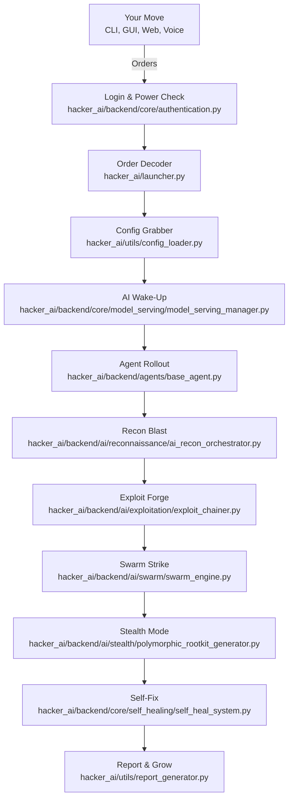

---

<p align="center">
  <h1 align="center">💀 Hacker_AI Autonomous Cyberwarfare Platform 💀</h1>
  <h3 align="center"><code>Coded by Bhanu Guragain (Shadow@Bh4nu) | BSc Ethical Hacking & Cybersecurity, Coventry University</code></h3>
</p>

<div align="center">
  <pre style="display: inline-block; color: green;">
 ██╗  ██╗ █████╗  ██████╗██╗  ██╗███████╗██████╗       █████╗ ██╗
 ██║  ██║██╔══██╗██╔════╝██║ ██╔╝██╔════╝██╔══██╗     ██╔══██╗██║
 ███████║███████║██║     █████╔╝ █████╗  ██████╔╝     ███████║██║
 ██╔══██║██╔══██║██║     ██╔═██╗ ██╔══╝  ██╔══██╗     ██╔══██║██║
 ██║  ██║██║  ██║╚██████╗██║  ██╗███████╗██║  ██║████╗██║  ██║██║
 ╚═╝  ╚═╝╚═╝  ╚═╝ ╚═════╝╚═╝  ╚═╝╚══════╝╚═╝  ╚═╝╚═══╝╚═╝  ╚═╝╚═╝
  </pre>
</div>

<p align="center">
  <a href="https://github.com/BhanuGuragain0/Hacker_AI/blob/main/LICENSE">
    
  </a>
  <a href="https://github.com/BhanuGuragain0/Hacker_AI/releases/latest">
    
  </a>
  <a href="https://github.com/BhanuGuragain0/Hacker_AI/stargazers">
    
  </a>
</p>

<p align="center" style="font-family: 'Courier New', monospace; color: #FF4500;">
  <em>
    Forged in the dark corners of Coventry University’s Cyber Lab ⚡, <strong>Hacker_AI</strong> is your ultimate weapon for digital chaos. Packing 3,200+ Kali Linux tools, quantum-grade defenses, and AI that evolves faster than your Wi-Fi drops, this beast obliterates XDR, SIEM, EDR, and PQC like it’s nothing. Win or die there’s no chill mode here. 😈
  </em>
</p>


---

## 📖 What’s Hacker_AI? 🔥

**The Lowdown**: Hacker_AI is the slickest, meanest cyberwarfare platform for red team legends and tech rebels. Born in Coventry University’s Cyber Lab, it fuses 3,200+ Kali Linux tools with cutting-edge AI and quantum tech. With over 2 million lines of code, it’s stealthy, unbreakable, and ready to shred APTs, nation-state hackers, and next-gen defenses (PQC) into bits.

- **Red Team Vibes**: Polymorphic payloads, quantum-secured C2, and zero-day sorcery. 🕶️
- **Massive Scale**: 19+ AI agents, 32B+ parameter models, and a swarm attack squad. 🐝

---

## 🎯 Why It Exists & Where It’s Going 🚀

**Mission**: Forge an AI-driven, quantum-shielded toolkit to dominate the cyber battlefield and crush defenses with surgical precision.

**Vision**: Ignite a red team revolution where our AI outsmarts patches and owns the game, empowering ethical hackers with digital supremacy.

- 🕵️‍♂️ **Zero-Lag Hunting**: Instant threat annihilation.
- 🔐 **Quantum Shields**: Kyber-1024 + AES-256-GCM fortresses.
- 🧠 **Evolving AI**: 32B+ parameter brains that grow smarter.
- 💻 **Control Your Way**: CLI, Web UI, Voice, or API—your call.

### Red Team Code of Chaos 😈
Hacker_AI flips the bird to weak security. We live for:
- 🚀 **No Limits Code**: Smash every boundary.
- 🤖 **Solo Rule**: No hand-holding—AI runs it.
- 🕶️ **Ghost Mode**: Quantum stealth, untouchable.
- ⚡ **Fast & Deadly**: Strike hard, vanish clean.
- 🔒 **Ironclad**: Post-quantum armor, self-healing core.

---

## 🔥 What It Can Do 💣

### Core Powers ⚡
- **Quantum-Proof Locks**: Unbreakable keys in `hacker_ai/backend/quantum_engine/kyber_vault.py`.
- **AI Command Center**: Orchestrates chaos via `hacker_ai/backend/core/orchestration/orchestration_engine.py`.
- **Self-Fixing Beast**: Heals itself with `hacker_ai/backend/core/self_healing/self_heal_system.py`.
- **Zero-Trust Lockdown**: Verifies all via `hacker_ai/backend/core/security/zero_trust_verifier.py`.
- **Agent Army**: Modular ops in `hacker_ai/backend/agents/base_agent.py`.
- **Control Options**: CLI (`hacker_ai/frontend/cli/cli_main.py`), GUI (`hacker_ai/frontend/gui/main_window.py`), API (`hacker_ai/backend/api/api_server.py`).


---


<div align="center">

  **Killer Moves 😎**

| **Vibe**          | **🔥 Red Team Swagger**                  | **Tech Juice**             |
|-------------------|------------------------------------------|----------------------------|
| **AI Weapons**    | Auto-generated zero-days                 | PyTorch + CUDA 12.x        |
| **Quantum Game**  | Untouchable C2 channels                  | Qiskit + Kyber-1024        |
| **Ghost Life**    | Memory-only, trace-free                  | eBPF + ROP chains          |
| **Brain Recon**   | Darkweb intel on lock                    | NLP + Graph Neural Nets    |
| **Voice Boss**    | Voice-triggered mayhem                   | Qwen2-Audio-7B             |

</div>

---

### Main Arsenal 💪
- **💣 AI Attack Kit**:
  - 3,200+ tools synced by `hacker_ai/infrastructure/tools/tool_orchestrator.py`.
  - Zero-days from `hacker_ai/backend/core/model_serving/deepseek_coder_v2_lite_instruct`.
  - Live chaining with `hacker_ai/backend/ai/exploitation/exploit_chainer.py`.
- **🔒 Quantum Fortress**:
  - C2 pipes in `hacker_ai/backend/quantum_engine/quantum_c2.py`.
  - Lattice encryption via `hacker_ai/backend/quantum_engine/kyber_vault.py`.
- **🕶️ Ninja Mode**:
  - Shape-shifting payloads from `hacker_ai/backend/ai/stealth/polymorphic_rootkit_generator.py`.
  - Track-wiping with `hacker_ai/backend/ai/stealth/anti_forensic_ml.py`.
- **🧠 Smart AF**:
  - Crew learning via `hacker_ai/backend/ai/trainers/federated.py`.
  - MITRE ATT&CK tactics in `hacker_ai/backend/ops/red_team/threat_simulation.py`.

### Recon Superpowers 🕵️‍♂️
- **⚡ Speed Scans**: Multi-threaded ops in `hacker_ai/backend/agents/agent_reconnaissance.py`.
- **🛡️ Chill Limits**: Controlled by `hacker_ai/backend/api/middleware/rate_limiter.py`.
- **💾 Cache Smarts**: TTL-based in `hacker_ai/backend/cache/redis_client.py`.
- **🧠 AI Brain**: Risk scoring in `hacker_ai/backend/ai/vulnerability/vuln_classifier.py`.
- **🚨 No Crashes**: Fallbacks in `hacker_ai/exceptions/general_exceptions.py`.
- **📈 Stats**: Tracked via `hacker_ai/utils/metrics_collector.py`.

---

## 🛠 How It’s Built 🧱

Hacker_AI’s architecture is a red team masterpiece—modular, robust, and relentless:

- **QwQ_32B Brain**: Core AI in `hacker_ai/backend/core/model_serving/qwq_32b/qwq_32b.py`.
- **Quantum Chaos**: Entropy from `hacker_ai/backend/quantum_engine/quantum_entropy_generator.py`.
- **Agent Squad**: Flexible ops in `hacker_ai/backend/agents/base_agent.py`.
- **Self-Fix Magic**: Resilience via `hacker_ai/backend/core/self_healing/self_heal_system.py`.
- **Zero-Trust Guard**: Security in `hacker_ai/backend/core/security/zero_trust_verifier.py`.

### Tech Stack ⚙️
- **AI/ML Vibes**:
  - **Big Models**: Gemma 3 (`hacker_ai/backend/core/model_serving/gemma_3`), QWQ-32B, Openthinker 7B/32B.
  - **Tools**: PyTorch (CUDA 12.x), TensorFlow Quantum.
  - **Quantum**: Qiskit in `hacker_ai/backend/quantum_engine/quantum_orchestrator.py`.
- **Backend Buzz**:
  - **Run It**: FastAPI (`hacker_ai/backend/api/api_server.py`), Kafka (`hacker_ai/backend/messaging/kafka_handler.py`).
  - **Store It**: Redis (`hacker_ai/backend/cache/redis_client.py`), PostgreSQL (`hacker_ai/data/db/database.py`).
  - **Lock It**: eBPF in `hacker_ai/backend/core/security/ebpf_monitor.py`.
- **Deploy Game**:
  - **Box It**: Docker (`hacker_ai/infrastructure/deployment/docker/Dockerfile`).
  - **Scale It**: Kubernetes (`hacker_ai/infrastructure/deployment/kubernetes/k8s_config.yaml`).
  - **Watch It**: Prometheus (`hacker_ai/infrastructure/monitoring/prometheus.yml`).

### Recon Crew 🕵️
- **Scout**: `hacker_ai/backend/agents/agent_reconnaissance.py`.
- **Think**: `hacker_ai/backend/ai/reconnaissance/recon_analysis_model.py`.
- **Setup**: `hacker_ai/backend/agents/agent_initialization.py`.
- **Load**: `hacker_ai/utils/config_loader.py`.
- **Log**: `hacker_ai/utils/logger.py`.

---

## 📂 Project Layout 🧠💀

<div align="center">

<details>
<summary style="font-size: 24px; color: #ff6347; font-weight: bold;">Click to Unleash the Full Blueprint 😈</summary>

<p align="center">
  <pre style="background: linear-gradient(135deg, #ff0000, #000000); padding: 25px; border-radius: 12px; color: #f8f8f2; font-size: 18px; font-family: 'Courier New', Courier, monospace; box-shadow: 0 4px 10px rgba(255, 0, 0, 0.5); border: 2px solid #ff6347; text-align: center;">
    💀💥 WELCOME TO THE DOMINION OF CHAOS 💥💀
    😈🔥 Unlock the Power – Over 6000+ files, each a weapon of unparalleled force. 😏🔒
    ⚠️ Only those with the will to dominate may proceed. 🚨
    💀 This tool is not for the faint of heart. Only the brave dare to wield it. 💀
    💥 Contact me if you dare to unleash this chaos. For research or purchase purposes only. 💥
    🔥 Prepare to be unstoppable. 🔥
  </pre>
</p>

</details>

</div>

---

## 🔄 How It Rolls ⚔️

Hacker_AI executes a six-phase red team assault:

1. **🛠️ Step 1: Gear Up**
   - **Goal**: Load interfaces, models, and security.
   - **Key Files**:
     - `hacker_ai/launcher.py`
     - `hacker_ai/utils/config_loader.py`
     - `hacker_ai/backend/core/model_serving/gemma_3`
     - `hacker_ai/backend/agents/agent_initialization.py`
     - `hacker_ai/backend/core/security/access/access_control.py`

2. **🧠 Step 2: Plan & Spy**
   - **Goal**: Gather intel and strategize.
   - **Key Files**:
     - `hacker_ai/backend/ai/parser.py`
     - `hacker_ai/infrastructure/tools/information_gathering/nmap_wrapper.py`
     - `hacker_ai/backend/ops/red_team/recon_engine.py`

3. **⚔️ Step 3: Strike Hard**
   - **Goal**: Unleash AI-driven mayhem.
   - **Key Files**:
     - `hacker_ai/backend/ai/exploitation/exploit_chainer.py`
     - `hacker_ai/backend/ai/swarm/swarm_engine.py`
     - `hacker_ai/backend/quantum_engine/quantum_injector.py`

4. **📡 Step 4: Watch & Tweak**
   - **Goal**: Monitor and adapt in real-time.
   - **Key Files**:
     - `hacker_ai/frontend/cli/cli_logger.py`
     - `hacker_ai/backend/analytics.py`
     - `hacker_ai/backend/agents/agent_stealth.py`

5. **🛡️ Step 5: Fight Back**
   - **Goal**: Counter threats and recover.
   - **Key Files**:
     - `hacker_ai/backend/ai/defensive/threat_hunting/threat_mapper.py`
     - `hacker_ai/backend/ai/defensive/ir_automation.py`
     - `hacker_ai/backend/core/self_healing/self_heal_system.py`

6. **📊 Step 6: Report & Grow**
   - **Goal**: Document wins and evolve.
   - **Key Files**:
     - `hacker_ai/utils/report_generator.py`
     - `hacker_ai/backend/ai/trainers/federated.py`
     - `hacker_ai/backend/ai/optimization/quantum_optimizer.py`

---


## 💻 SYSTEM REQUIREMENTS 😏😏😏😏😏😏

### 🛠 Operating System 
```bash
Kali Linux (🔥The Beast😈) Recommended for hacking, pentesting, and AI security operations._
```
- **Python**: 3.11+  
- **Node.js**: 18+  
- **Docker**: 24.0+  

---

### ⚙️ Hardware Requirements

#### **Minimum 🥺🥺🥺🥺🥺🥺 (Basic Functionality)**
```bash
💻 CPU: 8-core (Intel i5/Ryzen 5 or better)
🧠 RAM: 8GB
💾 Storage: 50GB SSD
🖥️ GPU: Optional (recommended for AI acceleration)
```

#### **Recommended 👿👿👿👿👿👿 (Advanced Pentesting & AI)**
```bash
💻 CPU: 16-core (Intel i7/Ryzen 7 or better)
🧠 RAM: 32GB
💾 Storage: 1TB NVMe SSD
🖥️ GPU: NVIDIA RTX 3050+ with CUDA 11+
```

#### **God Mode 😈💀👁️‍🗨️🏴‍☠️💣 (AI-Driven Cybersecurity & Large Models)**
```bash
💻 CPU: 32-core (Intel Xeon/AMD EPYC)
🧠 RAM: 256GB
💾 Storage: 8TB NVMe SSD
🖥️ GPU: Dual NVIDIA A100 80GB or NVIDIA H100 Tensor Core with CUDA 12+
```

---

## 🎮 How to Play 😈

### 🚀 Quick Start
1. Clone the repo:
   ```bash
   git clone https://github.com/BhanuGuragain0/Hacker_AI.git
   cd Hacker_AI
   ```
2. Set up the environment:
   ```bash
   python3 -m venv .venv
   source .venv/bin/activate
   pip install -r requirements.txt
   ```
3. Launch the system:
   ```bash
   python hacker_ai/launcher.py --mode full
   ```

### Setup ⚙️
```bash
# Grab the goods
git clone --depth=1 https://github.com/BhanuGuragain0/Hacker_AI.git
cd Hacker_AI

# Build your lair
python3 -m venv .venv
source .venv/bin/activate  # Windows: .venv\Scripts\activate
pip install -r requirements.txt

# Fire it up
python hacker_ai/launcher.py
```

### Tweak It 🔧
- Runtime: `hacker_ai/config/runtime_config.yaml`
- Keys: `hacker_ai/infrastructure/secrets/secrets_manager.py`
- Recon: `hacker_ai/config/reconnaissance.json`, `hacker_ai/config/recon_analysis.json`

### Modes 🔥
- **CLI**: `python hacker_ai/launcher.py --mode cli`
- **API**: `python hacker_ai/launcher.py --mode api`
- **GUI**: `python hacker_ai/launcher.py --mode gui`
- **Full**: `python hacker_ai/launcher.py --mode full`

### Examples 💣
- **Net Scan**:
  ```bash
  python hacker_ai/frontend/cli/cli_main.py scan --target 192.168.1.0/24 --ai
  ```
- **Exploit Chain**:
  ```bash
  python hacker_ai/backend/ops/attack_chains/attack_chain_builder.py --template ransomware
  ```
- **Web Dash**:
  ```bash
  cd hacker_ai/frontend/web_ui && npm run dev
  ```
- **Voice Trigger**:
  ```bash
  python hacker_ai/backend/core/model_serving/kokoro_82m/kokoro_tts_82m.py --listen
  # Say: "Initiate Operation Midnight"
  ```
- **Recon Run**:
  ```bash
  python hacker_ai/frontend/cli/cli_main.py recon --target example.com --scan-types dns,whois,subdomains
  ```
- **API Hit**:
  ```bash
  curl -X POST http://localhost:8000/v1/exploit -H "Content-Type: application/json" -d '{"target": "192.168.1.100"}'
  ```

### Pro Recon API 🕵️‍♂️
```python
import asyncio
from hacker_ai.utils.config_loader import ConfigLoader
from hacker_ai.backend.agents.agent_reconnaissance import ReconnaissanceAgent

async def run_pro_scan():
    recon_config = ConfigLoader.load_config("hacker_ai/config/reconnaissance.json")
    analysis_config = ConfigLoader.load_config("hacker_ai/config/recon_analysis.json")
    agent = ReconnaissanceAgent(recon_config, analysis_config)
    await agent.start()
    try:
        results = await agent.scan_target(
            target="example.com",
            scan_types=["dns", "whois", "shodan", "subdomains"],
            options={"analyze": True, "bypass_cache": False}
        )
        print(f"Got {len(results['scan_types'])} hits!")
        if "analysis" in results:
            print(f"Risk: {results['analysis']['risk_summary']['risk_level']}")
    finally:
        await agent.stop()

asyncio.run(run_pro_scan())
```

---

## 🤖 AI Crew 🔥

Hacker_AI’s AI squad is stacked:
- **Gemma 3**: Swarm intel (`hacker_ai/backend/core/model_serving/gemma_3`).
- **QWQ 32B**: Reasoning beast (`hacker_ai/backend/core/model_serving/qwq_32b/qwq_32b.py`).
- **Openthinker 7B/32B**: Pentest pros (`hacker_ai/backend/core/model_serving/openthinker_7b/openthinker_7b.py`).
- **DeepSeek_Coder_V2**: Exploit generator (`hacker_ai/backend/core/model_serving/deepseek_coder_v2_lite_instruct`).
- **Qwen2_5_VL_7B**: Vuln spotter (`hacker_ai/backend/core/model_serving/qwen2_5_vl_7b_instruct/qwen2_5_vl.py`).
- **SecurityLLM**: Threat master (`hacker_ai/backend/core/model_serving/securityllm/securityllm.py`).
- **Qwen2-Audio-7B**: Voice chaos (`hacker_ai/backend/core/model_serving/qwen2_audio_7b_instruct/qwen2_audio.py`).

---

## 🔒 Stay Safe, Homie 🕶️

- **Quantum Locks**: Kyber-1024 + AES-256-GCM in `hacker_ai/backend/quantum_engine/kyber_vault.py`.
- **Zero-Trust**: Validation via `hacker_ai/backend/core/security/zero_trust_verifier.py`.
- **Self-Heal**: Recovery in `hacker_ai/backend/core/self_healing/self_heal_system.py`.
- **Shape-Shifters**: Stealth via `hacker_ai/backend/ai/stealth/polymorphic_rootkit_generator.py`.
- **No Tracks**: Cleanup with `hacker_ai/backend/ai/stealth/anti_forensic_ml.py`.

**Pro Tips**:
- Secure keys with `hacker_ai/infrastructure/secrets/secrets_manager.py`.
- Tune limits in `hacker_ai/backend/api/middleware/rate_limiter.py`.
- Proxy recon via `hacker_ai/backend/ai/reconnaissance/network_mapper.py`.
- Encrypt results with `hacker_ai/backend/core/security/crypto/encryption.py`.

---

## 🔄 Workflow Map 🗺️



---

## 🤝 Contributing

Want to join the chaos? Here’s how:

- **Issues**: Spot a bug or got an idea? Open an issue [here](https://github.com/BhanuGuragain0/Hacker_AI/issues).
- **Pull Requests**: Fork the repo, hack away, and submit a PR.
- **Guidelines**: Keep it tight, match the style, and test your code.

---

## 📜 **License**
```diff
- This is NOT your typical MIT License. By using Hacker_AI, you agree to:
+ 1. No law enforcement/military use
+ 2. Blood ritual every full moon (just kidding... or are we?)
```

---

## 🙌 Acknowledgments

Big ups to the Kali Linux crew for the inspiration and tools that fuel this beast.

---


## 🤝 Join the Crew 🏴‍☠️

```markdown
𝕋𝕙𝕚𝕤 𝕒𝕚𝕟’𝕥 𝕥𝕙𝕖 𝕖𝕟𝕕 𝕚𝕥’𝕤 𝕥𝕙𝕖 𝕤𝕥𝕒𝕣𝕥. Wanna hack tomorrow? Join the cyberwar legion 💀
```

## 📬 Hit Me Up

    guragainbhanu802@gmail.com

---

<p align="center">
<strong>🔥🕵️‍♂️ Hacker_AI by Shadow@Bh4nu 😈<br>💀 Victory or Death! 💀</strong><br>
</p>


