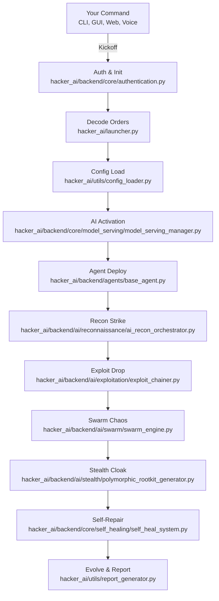

<p align="center">
  <h1 align="center">💀 Hacker_AI Autonomous Cyberwarfare Platform 💀</h1>
  <h3 align="center"><code>Coded by Bhanu Guragain (Shadow@Bh4nu) | BSc Ethical Hacking & Cybersecurity, Coventry University</code></h3>
</p>

<div align="center">
  <pre style="display: inline-block; color: green;">
 ██╗  ██╗ █████╗  ██████╗██╗  ██╗███████╗██████╗       █████╗ ██╗
 ██║  ██║██╔══██╗██╔════╝██║ ██╔╝██╔════╝██╔══██╗     ██╔══██╗██║
 ███████║███████║██║     █████╔╝ █████╗  ██████╔╝     ███████║██║
 ██╔══██║██╔══██║██║     ██╔═██╗ ██╔══╝  ██╔══██╗     ██╔══██║██║
 ██║  ██║██║  ██║╚██████╗██║  ██╗███████╗██║  ██║████╗██║  ██║██║
 ╚═╝  ╚═╝╚═╝  ╚═╝ ╚═════╝╚═╝  ╚═╝╚══════╝╚═╝  ╚═╝╚═══╝╚═╝  ╚═╝╚═╝
  </pre>
</div>

<p align="center">
  <a href="https://github.com/BhanuGuragain0/Hacker_AI/blob/main/LICENSE">
    
  </a>
  <a href="https://github.com/BhanuGuragain0/Hacker_AI/releases/latest">
    
  </a>
  <a href="https://github.com/BhanuGuragain0/Hacker_AI/stargazers">
    
  </a>
</p>

<p align="center" style="font-family: 'Courier New', monospace; color: #FF4500;">
  <em>
    
    ⚡ Forged in the dark labs of Coventry University, Hacker_AI is the ultimate cyberwar badass. 🕶️💣 
    Armed with 3,200+ Kali Linux tools 🛠️🐉, AI-powered exploit automation 🤖💥, and quantum‑grade 
    stealth ⚛️🛡️, it tears through XDR, SIEM, EDR, and PQC 🔍🔥🔒⚡ like butter. 🧈🔪 Zero day expert 🕳️🎯,
    post hack domination 🏴‍☠️🚀, and auto attack chains 🔗🤖 win or wipe out. 💀🏆 No chill. No mercy. 😈🔥
    
  </em>
</p>

---

## 📖 What’s Hacker_AI? 🔥

🚀 **Hacker_AI**: A **DIGITAL SUPREMACY**-grade autonomous cyber warfare platform 🤖, forged in the **GANGA Offensive Ops Lab** 🧪. It combines an **AGI-grade modular framework** with Terraform 🏗️ for unlimited scalability. The system unleashes **quantum-resistant AI models** (e.g., `Gemma 3`, `QWQ 32B`, `DeepSeek` 🧠), **CRYSTALS-Kyber crypto** ⚛️, and **3,200+ Kali tools** 🛠️ across **2M+ lines of hardened code** 💻. **19+ AI agents** 🐝, **GAN-polymorphic payloads** 🕶️, and **meta-learning-driven strategies** DOMINATE cyber space, targeting **APTs**, **XDR/SIEM/EDR**, and **post-quantum cryptography (PQC)** with **SURGICAL STRIKES** 💣.  

**ETHICAL SAFEGUARDS**: Geofencing, kill switches, and NIST/GDPR compliance ensure use for **red team research and education only** ⚠️.  

**Features**:  
- Quantum-entangled payload fragmentation  
- Morphogenetic code rewriting for evasion  
- Meta-learning for autonomous evolution  
- FIPS 140-3 compliance and audit logging  

**For**:  
- Advanced red team simulations  
- Cybersecurity research  
- AGI-driven exploit development  

🔥 **"We don’t navigate. We fucking own the grid."** 🔥  

---

## 🎯 Why It Exists & Where It’s Going 🚀

### **Mission**  
To craft an AI-powered, quantum-hardened toolkit that rules the cyber battlefield, delivering precision strikes and unbreakable defenses.

### **Vision**  
To spark a red team uprising where **Hacker_AI** outsmarts patches, owns systems, and hands ethical hackers the keys to digital domination.

- 🕵️‍♂️ **Zero-Lag Hunting**: Threats die before they blink.
- 🔐 **Quantum Shields**: Kyber-1024 + AES-256-GCM = unhackable vibes.
- 🧠 **Evolving Brains**: 32B+ parameter models that adapt and conquer.
- 💻 **Your Rules**: CLI, Web UI, Voice, or API control it your way.

### Red Team Code of Chaos 😈
We don’t play nice. Here’s our creed:
- 🚀 **No Limits**: Code that breaks every ceiling.
- 🤖 **AI Solo**: No babysitting our agents run the show.
- 🕶️ **Ghost Mode**: Quantum stealth keeps us invisible.
- ⚡ **Fast & Furious**: Hit hard, vanish clean.
- 🔒 **Iron Core**: Post-quantum armor + self-healing grit.

---

## 🔥 What It Can Do 💣

### Core Powers ⚡
- **Quantum-Proof Locks**: Unbreakable encryption in `hacker_ai/backend/quantum_engine/kyber_vault.py`. 🔐
- **AI Command Hub**: Chaos coordination via `hacker_ai/backend/core/orchestration/orchestration_engine.py`. 🎛️
- **Self-Fixing Beast**: Auto-repairs with `hacker_ai/backend/core/self_healing/self_heal_system.py`. 🩺
- **Zero-Trust Wall**: Locks down trust in `hacker_ai/backend/core/security/zero_trust_verifier.py`. 🚪
- **Agent Swarm**: Modular ops in `hacker_ai/backend/agents/base_agent.py`. 🐝
- **Control Freak**: CLI (`hacker_ai/frontend/cli/cli_main.py`), GUI (`hacker_ai/frontend/gui/main_window.py`), API (`hacker_ai/backend/api/api_server.py`). 🎮

<div align="center">

### Killer Moves 😎
| **Vibe**          | **🔥 Red Team Swagger**                  | **Tech Juice**             |
|-------------------|------------------------------------------|----------------------------|
| **AI Weapons**    | Auto-crafted zero-days                  | PyTorch + CUDA 12.x        |
| **Quantum Game**  | Uncrackable C2 channels                 | Qiskit + Kyber-1024        |
| **Ghost Life**    | Memory-only, no footprints              | eBPF + ROP chains          |
| **Brain Recon**   | Darkweb intel mastery                   | NLP + Graph Neural Nets    |
| **Voice Boss**    | Voice-activated chaos                   | Qwen2-Audio-7B             |

</div>


### Main Arsenal 💪
- **💣 AI Attack Kit**:
  - Syncs **3,200+ tools** via `hacker_ai/infrastructure/tools/tool_orchestrator.py`.
  - Generates zero-days with `hacker_ai/backend/core/model_serving/deepseek_coder_v2_lite_instruct`.
  - Chains exploits live in `hacker_ai/backend/ai/exploitation/exploit_chainer.py`.
- **🔒 Quantum Fortress**:
  - Secures C2 with `hacker_ai/backend/quantum_engine/quantum_c2.py`.
  - Locks it down with lattice crypto in `hacker_ai/backend/quantum_engine/kyber_vault.py`.
- **🕶️ Ninja Mode**:
  - Morphs payloads via `hacker_ai/backend/ai/stealth/polymorphic_rootkit_generator.py`.
  - Wipes tracks with `hacker_ai/backend/ai/stealth/anti_forensic_ml.py`.
- **🧠 Smart AF**:
  - Learns as a crew in `hacker_ai/backend/ai/trainers/federated.py`.
  - Executes MITRE ATT&CK moves in `hacker_ai/backend/ops/red_team/threat_simulation.py`.

### Recon Superpowers 🕵️‍♂️
- **⚡ Speed Scans**: Multi-threaded recon in `hacker_ai/backend/agents/agent_reconnaissance.py`.
- **🛡️ Rate Control**: Throttled by `hacker_ai/backend/api/middleware/rate_limiter.py`.
- **💾 Cache Mastery**: TTL caching in `hacker_ai/backend/cache/redis_client.py`.
- **🧠 AI Smarts**: Risk scoring via `hacker_ai/backend/ai/vulnerability/vuln_classifier.py`.
- **🚨 Crash-Proof**: Fallbacks in `hacker_ai/exceptions/general_exceptions.py`.
- **📈 Metrics**: Tracked with `hacker_ai/utils/metrics_collector.py`.

---

## 🛠 How It’s Built 🧱

Hacker_AI’s architecture is a red team dream modular, resilient, and ruthless:

- **QwQ_32B Brain**: Powers AI in `hacker_ai/backend/core/model_serving/qwq_32b/qwq_32b.py`. 🧠
- **Quantum Chaos**: Entropy from `hacker_ai/backend/quantum_engine/quantum_entropy_generator.py`. ⚛️
- **Agent Squad**: Flexible agents in `hacker_ai/backend/agents/base_agent.py`. 🤖
- **Self-Fix Magic**: Heals via `hacker_ai/backend/core/self_healing/self_heal_system.py`. 🩺
- **Zero-Trust Guard**: Secures with `hacker_ai/backend/core/security/zero_trust_verifier.py`. 🔒

### Tech Stack ⚙️
- **AI/ML Vibes**:
  - **Models**: Gemma 3 (`hacker_ai/backend/core/model_serving/gemma_3`), QWQ-32B, Openthinker 7B/32B.
  - **Tools**: PyTorch (CUDA 12.x), TensorFlow Quantum.
  - **Quantum**: Qiskit in `hacker_ai/backend/quantum_engine/quantum_orchestrator.py`.
- **Backend Buzz**:
  - **Run It**: FastAPI (`hacker_ai/backend/api/api_server.py`), Kafka (`hacker_ai/backend/messaging/kafka_handler.py`).
  - **Store It**: Redis (`hacker_ai/backend/cache/redis_client.py`), PostgreSQL (`hacker_ai/data/db/database.py`).
  - **Lock It**: eBPF in `hacker_ai/backend/core/security/ebpf_monitor.py`.
- **Deploy Game**:
  - **Box It**: Docker (`hacker_ai/infrastructure/deployment/docker/Dockerfile`).
  - **Scale It**: Kubernetes (`hacker_ai/infrastructure/deployment/kubernetes/k8s_config.yaml`).
  - **Watch It**: Prometheus (`hacker_ai/infrastructure/monitoring/prometheus.yml`).

### Recon Crew 🕵️
- **Scout**: `hacker_ai/backend/agents/agent_reconnaissance.py`.
- **Think**: `hacker_ai/backend/ai/reconnaissance/recon_analysis_model.py`.
- **Setup**: `hacker_ai/backend/agents/agent_initialization.py`.
- **Load**: `hacker_ai/utils/config_loader.py`.
- **Log**: `hacker_ai/utils/logger.py`.

---

## 📂 Project Layout 🧠💀

<div align="center">

<details>
<summary style="font-size: 24px; color: #ff6347; font-weight: bold;">Click to Unleash the Full Blueprint 😈</summary>

<p align="center">
  <pre style="background: linear-gradient(135deg, #ff0000, #000000); padding: 25px; border-radius: 12px; color: #f8f8f2; font-size: 18px; font-family: 'Courier New', Courier, monospace; box-shadow: 0 4px 10px rgba(255, 0, 0, 0.5); border: 2px solid #ff6347; text-align: center;">
    💀💥 WELCOME TO THE DOMINION OF CHAOS 💥💀
    😈🔥 Unlock the Power – Over 6000+ files, each a weapon of unparalleled force. 😏🔒
    ⚠️ Only those with the will to dominate may proceed. 🚨
    💀 This tool is not for the faint of heart. Only the brave dare to wield it. 💀
    💥 Contact me if you dare to unleash this chaos. For research or purchase purposes only. 💥
    🔥 Prepare to be unstoppable. 🔥
  </pre>
</p>

</details>

</div>

---

## 🔄 How It Rolls ⚔️

Hacker_AI’s enhanced workflow is a seven-phase assault plan because six wasn’t chaotic enough:

1. **🛠️ Phase 1: Boot Up**
   - **Goal**: Initialize interfaces, load models, and lock down security.
   - **Key Files**:
     - `hacker_ai/launcher.py` 🚀
     - `hacker_ai/utils/config_loader.py` ⚙️
     - `hacker_ai/backend/core/model_serving/gemma_3` 🧠
     - `hacker_ai/backend/agents/agent_initialization.py` 🤖
     - `hacker_ai/backend/core/security/access/access_control.py` 🔑

2. **🕵️‍♂️ Phase 2: Recon & Plot**
   - **Goal**: Gather intel and craft a master plan.
   - **Key Files**:
     - `hacker_ai/backend/ai/reconnaissance/ai_recon_orchestrator.py` 🕵️
     - `hacker_ai/infrastructure/tools/information_gathering/nmap_wrapper.py` 📡
     - `hacker_ai/backend/ops/red_team/recon_engine.py` 🧠

3. **💥 Phase 3: Strike First**
   - **Goal**: Deploy AI-driven exploits with surgical precision.
   - **Key Files**:
     - `hacker_ai/backend/ai/exploitation/exploit_chainer.py` 💣
     - `hacker_ai/backend/quantum_engine/quantum_injector.py` ⚛️
     - `hacker_ai/backend/ops/attack_chains/attack_chain_builder.py` 🔗

4. **🐝 Phase 4: Swarm Assault**
   - **Goal**: Unleash coordinated swarm attacks.
   - **Key Files**:
     - `hacker_ai/backend/ai/swarm/swarm_engine.py` 🐝
     - `hacker_ai/backend/core/orchestration/orchestration_engine.py` 🎻
     - `hacker_ai/backend/agents/base_agent.py` 🤖

5. **📡 Phase 5: Monitor & Adapt**
   - **Goal**: Track progress and tweak in real-time.
   - **Key Files**:
     - `hacker_ai/frontend/cli/cli_logger.py` 📜
     - `hacker_ai/backend/analytics.py` 📈
     - `hacker_ai/utils/metrics_collector.py` 📊

6. **🛡️ Phase 6: Defend & Recover**
   - **Goal**: Counter threats and self-heal.
   - **Key Files**:
     - `hacker_ai/backend/ai/defensive/threat_hunting/threat_mapper.py` 🕵️‍♂️
     - `hacker_ai/backend/core/self_healing/self_heal_system.py` 🩺
     - `hacker_ai/backend/ai/defensive/ir_automation.py` 🚨

7. **📈 Phase 7: Learn & Evolve**
   - **Goal**: Analyze results and level up.
   - **Key Files**:
     - `hacker_ai/utils/report_generator.py` 📝
     - `hacker_ai/backend/ai/trainers/federated.py` 🏋️
     - `hacker_ai/backend/ai/optimization/quantum_optimizer.py` 🔮

---

## 💻 System Requirements 😏

### 🛠 Operating System
```bash
Kali Linux (🔥 The Beast 😈) - The ultimate playground for hacking, pentesting, and AI-driven chaos.
```
- **Python**: 3.11+ 🐍
- **Node.js**: 18+ 🚀
- **Docker**: 24.0+ 🐳

### ⚙️ Hardware Requirements

#### **Minimum 🥺 (Basic Chaos)**
```bash
💻 CPU: 8-core (Intel i5/Ryzen 5 or better)
🧠 RAM: 8GB
💾 Storage: 50GB SSD
🖥️ GPU: Optional (but c’mon, live a little!)
```

#### **Recommended 👿 (Pro Pentesting & AI)**
```bash
💻 CPU: 16-core (Intel i7/Ryzen 7 or better)
🧠 RAM: 32GB
💾 Storage: 1TB NVMe SSD
🖥️ GPU: NVIDIA RTX 3050+ with CUDA 11+
```

#### **God Mode 😈💀 (Cyberwarfare Overlord)**
```bash
💻 CPU: 32-core (Intel Xeon/AMD EPYC)
🧠 RAM: 256GB
💾 Storage: 8TB NVMe SSD
🖥️ GPU: Dual NVIDIA A100 80GB or H100 Tensor Core with CUDA 12+
```

---

## 🎮 How to Play 😈

### 🚀 Quick Start
1. Clone the repo:
   ```bash
   git clone https://github.com/BhanuGuragain0/Hacker_AI.git
   cd Hacker_AI
   ```
2. Set up the lair:
   ```bash
   python3 -m venv .venv
   source .venv/bin/activate
   pip install -r requirements.txt
   ```
3. Unleash the beast:
   ```bash
   python hacker_ai/launcher.py --mode full
   ```

### Setup ⚙️
```bash
# Snag the code
git clone --depth=1 https://github.com/BhanuGuragain0/Hacker_AI.git
cd Hacker_AI

# Build the environment
python3 -m venv .venv
source .venv/bin/activate  # Windows: .venv\Scripts\activate
pip install -r requirements.txt

# Launch the chaos
python hacker_ai/launcher.py
```

### Tweak It 🔧
- **Runtime**: `hacker_ai/config/runtime_config.yaml` ⚙️
- **Keys**: `hacker_ai/infrastructure/secrets/secrets_manager.py` 🔑
- **Recon**: `hacker_ai/config/reconnaissance.json`, `hacker_ai/config/recon_analysis.json` 🕵️

### Modes 🔥
- **CLI**: `python hacker_ai/launcher.py --mode cli` ⌨️
- **API**: `python hacker_ai/launcher.py --mode api` 🌐
- **GUI**: `python hacker_ai/launcher.py --mode gui` 🖼️
- **Full**: `python hacker_ai/launcher.py --mode full` 💪

### Examples 💣
- **Net Scan**:
  ```bash
  python hacker_ai/frontend/cli/cli_main.py scan --target 192.168.1.0/24 --ai
  ```
- **Exploit Chain**:
  ```bash
  python hacker_ai/backend/ops/attack_chains/attack_chain_builder.py --template ransomware
  ```
- **Web Dash**:
  ```bash
  cd hacker_ai/frontend/web_ui && npm run dev
  ```
- **Voice Trigger**:
  ```bash
  python hacker_ai/backend/core/model_serving/kokoro_82m/kokoro_tts_82m.py --listen
  # Say: "Initiate Operation Midnight"
  ```
- **Recon Run**:
  ```bash
  python hacker_ai/frontend/cli/cli_main.py recon --target example.com --scan-types dns,whois,subdomains
  ```
- **API Hit**:
  ```bash
  curl -X POST http://localhost:8000/v1/exploit -H "Content-Type: application/json" -d '{"target": "192.168.1.100"}'
  ```

### Pro Recon API 🕵️‍♂️
```python
import asyncio
from hacker_ai.utils.config_loader import ConfigLoader
from hacker_ai.backend.agents.agent_reconnaissance import ReconnaissanceAgent

async def run_pro_scan():
    recon_config = ConfigLoader.load_config("hacker_ai/config/reconnaissance.json")
    analysis_config = ConfigLoader.load_config("hacker_ai/config/recon_analysis.json")
    agent = ReconnaissanceAgent(recon_config, analysis_config)
    await agent.start()
    try:
        results = await agent.scan_target(
            target="example.com",
            scan_types=["dns", "whois", "shodan", "subdomains"],
            options={"analyze": True, "bypass_cache": False}
        )
        print(f"Got {len(results['scan_types'])} hits! 🎯")
        if "analysis" in results:
            print(f"Risk: {results['analysis']['risk_summary']['risk_level']} 🚨")
    finally:
        await agent.stop()

asyncio.run(run_pro_scan())
```

---

## 🤖 AI Crew 🔥

Hacker_AI’s AI squad is a stacked lineup of digital assassins:
- **Gemma 3**: Swarm coordinator (`hacker_ai/backend/core/model_serving/gemma_3`). 🐝
- **QWQ 32B**: Reasoning titan (`hacker_ai/backend/core/model_serving/qwq_32b/qwq_32b.py`). 🧠
- **Openthinker 7B/32B**: Pentest maestros (`hacker_ai/backend/core/model_serving/openthinker_7b/openthinker_7b.py`). 💻
- **DeepSeek_Coder_V2**: Exploit craftsman (`hacker_ai/backend/core/model_serving/deepseek_coder_v2_lite_instruct`). 💥
- **Qwen2_5_VL_7B**: Vuln hunter (`hacker_ai/backend/core/model_serving/qwen2_5_vl_7b_instruct/qwen2_5_vl.py`). 👁️
- **SecurityLLM**: Threat overlord (`hacker_ai/backend/core/model_serving/securityllm/securityllm.py`). 🔒
- **Qwen2-Audio-7B**: Voice chaos maker (`hacker_ai/backend/core/model_serving/qwen2_audio_7b_instruct/qwen2_audio.py`). 🎤

---

## 🔒 Stay Safe, Homie 🕶️

- **Quantum Locks**: Kyber-1024 + AES-256-GCM in `hacker_ai/backend/quantum_engine/kyber_vault.py`. 🔐
- **Zero-Trust**: Ironclad checks in `hacker_ai/backend/core/security/zero_trust_verifier.py`. 🚪
- **Self-Heal**: Auto-recovery via `hacker_ai/backend/core/self_healing/self_heal_system.py`. 🩺
- **Shape-Shifters**: Polymorphic stealth in `hacker_ai/backend/ai/stealth/polymorphic_rootkit_generator.py`. 🎭
- **No Tracks**: Forensic wipe with `hacker_ai/backend/ai/stealth/anti_forensic_ml.py`. 🧹

**Pro Tips**:
- Lock keys in `hacker_ai/infrastructure/secrets/secrets_manager.py`. 🔑
- Tweak limits with `hacker_ai/backend/api/middleware/rate_limiter.py`. ⚖️
- Proxy recon via `hacker_ai/backend/ai/reconnaissance/network_mapper.py`. 🌐
- Encrypt loot with `hacker_ai/backend/core/security/crypto/encryption.py`. 🔍

---

## 🔄 Workflow Map 🗺️



---

## 🤝 Contributing

Ready to join the chaos? Here’s the playbook:
- **Issues**: Spot a glitch or got a wild idea? Drop it [here](https://github.com/BhanuGuragain0/Hacker_AI/issues). 🐞
- **Pull Requests**: Fork it, hack it, PR it. 💻
- **Rules**: Keep it clean, match the vibe, and test your stuff. ✅

---

## 📜 License
```diff
- Not your average MIT License. Using Hacker_AI means:
+ 1. No law enforcement/military vibes allowed.
+ 2. Full moon rituals optional (we’re watching 👀).
```

---

## 🙌 Acknowledgments

Shoutout to the Kali Linux crew for the tools and inspo that power this monster. 🙏

---

## 🤝 Join the Crew 🏴‍☠️

```markdown
𝕋𝕙𝕚𝕤 𝕒𝕚𝕟’𝕥 𝕥𝕙𝕖 𝕖𝕟𝕕 𝕚𝕥’𝕤 𝕥𝕙𝕖 𝕤𝕥𝕒𝕣𝕥. Ready to hack the future? Join the cyberwar legion! 💀
```

## 📬 Hit Me Up
    guragainbhanu802@gmail.com 📧

---

<p align="center">
<strong>🔥🕵️‍♂️ Hacker_AI by Shadow@Bh4nu 😈<br>💀 Victory or Death! 💀</strong>
</p>


