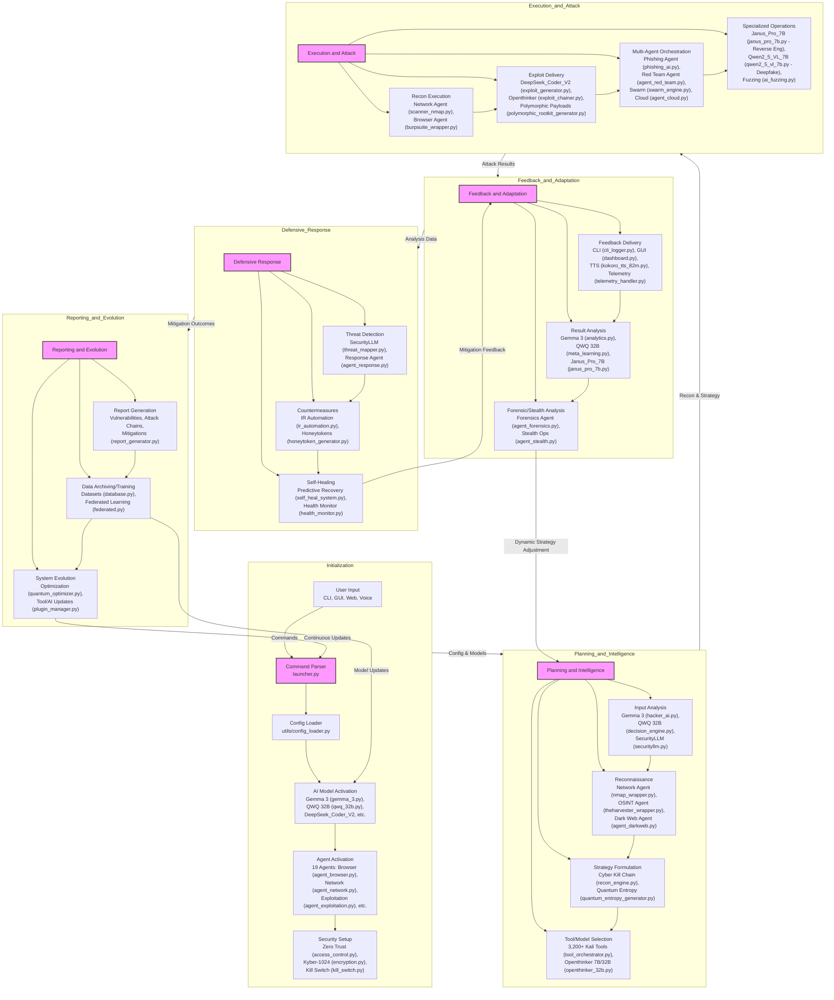

---

<p align="center">
  <h1 align="center">💀 Hacker_AI Autonomous Cyberwarfare Platform 💀</h1>
  <h3 align="center"><code>Developed by Bhanu Guragain (Shadow@Bh4nu) | BSc Ethical Hacking & Cybersecurity, Coventry University</code></h3>
</p>

<p align="center">
  <a href="https://github.com/BhanuGuragain0/Hacker_AI/actions/workflows/ci.yml">
    
  </a>
  <a href="https://github.com/BhanuGuragain0/Hacker_AI/blob/main/LICENSE">
    
  </a>
  <a href="https://github.com/BhanuGuragain0/Hacker_AI/releases/latest">
    
  </a>
  <a href="https://github.com/BhanuGuragain0/Hacker_AI/stargazers">
    
  </a>
</p>

<p align="center" style="font-family: 'Courier New', monospace; color: #FF4500;">
  <em>
    Engineered at Coventry University's Cyber Lab ⚡, <strong>Hacker_AI</strong> is a next-generation autonomous cyberwarfare platform.
    Combining quantum-resistant cryptography, adaptive AI, and polymorphic attack vectors, it redefines offensive cybersecurity.
  </em>
</p>

---

<!-- Centered ASCII Art Block -->
<div align="center">
  <pre style="display: inline-block; color: green;">
 ██╗  ██╗ █████╗  ██████╗██╗  ██╗███████╗██████╗       █████╗ ██╗
 ██║  ██║██╔══██╗██╔════╝██║ ██╔╝██╔════╝██╔══██╗     ██╔══██╗██║
 ███████║███████║██║     █████╔╝ █████╗  ██████╔╝     ███████║██║
 ██╔══██║██╔══██║██║     ██╔═██╗ ██╔══╝  ██╔══██╗     ██╔══██║██║
 ██║  ██║██║  ██║╚██████╗██║  ██╗███████╗██║  ██║████╗██║  ██║██║
 ╚═╝  ╚═╝╚═╝  ╚═╝ ╚═════╝╚═╝  ╚═╝╚══════╝╚═╝  ╚═╝╚═══╝╚═╝  ╚═╝╚═╝
  </pre>
</div>

---

## 🚀 Mission & Vision

**Autonomous Cyber Dominance Through AI**

```markdown
- 🕵️‍♂️ Autonomous threat hunting with zero human latency
- 🔐 Quantum-grade encryption (Kyber-1024 + AES-256-GCM)
- 🧠 Self-evolving AI models (32B+ parameter agents)
- 💻 Multi-interface control (CLI, Web UI, Voice, API)

```

---

## 🚀 **Features That Redefine Cyberwarfare**

<div align="center">

| **Category**      | **🔥 Signature Capabilities**                     | **Tech Specs**                      |
|-------------------|---------------------------------------------------|-------------------------------------|
| **AI Arsenal**    | Autonomous zero-day generation                    | PyTorch + CUDA 12.x                |
| **Quantum Ops**   | Unbreakable C2 channels                           | Qiskit + Kyber-1024                |
| **Ghost Mode**    | Memory-only execution                             | eBPF + ROP chains                  |
| **Neural Recon**  | Darkweb intelligence harvesting                   | NLP + Graph Neural Networks        |
| **Voice Control** | Natural language command interface                | Qwen2-Audio-7B                     |

</div>

---

## 🔥 Core Capabilities

- **AI-Driven Offensive Suite**:
  - 3,200+ integrated pentesting tools orchestrated via `tool_orchestrator.py`
  - Autonomous exploit generation (`deepseek_coder_v2_lite_instruct`)
  - Real-time vulnerability chaining (`exploit_chainer.py`)

- **Quantum-Secure Infrastructure**:
  - Post-quantum C2 channels (`quantum_c2.py`)
  - Lattice-based encryption (`kyber_vault.py`)

- **Stealth Operations**:
  - Polymorphic payloads (`polymorphic_rootkit_generator.py`)
  - Anti-forensic memory operations (`anti_forensic_ml.py`)

- **Adaptive Intelligence**:
  - Federated learning across agents (`trainers/federated.py`)
  - MITRE ATT&CK-aligned tactics (`threat_simulation.py`)

---

## 🛠 Technical Architecture

### AI/ML Stack
- **Core Models**: Gemma 3, QWQ-32B, Openthinker 7B/32B
- **Frameworks**: PyTorch (with CUDA 12.x), TensorFlow Quantum
- **Quantum**: Qiskit for quantum circuit simulation

### Backend
- **Orchestration**: FastAPI, Kafka (for inter-agent comms)
- **Database**: Redis (caching), PostgreSQL (threat intel)
- **Security**: eBPF-based monitoring, Zero-Trust auth

### Deployment
- **Containerization**: Docker with GPU passthrough
- **Orchestration**: Kubernetes (for swarm scaling)
- **Monitoring**: Prometheus + Grafana dashboards

---

## 📂 PROJECT STRUCTURE 🧠💀

<details>
<summary>Expand to View Full Structure</summary>
  
```bash

```
</details>

---

## 🧠 **Core Architecture**



---

## 💻 SYSTEM REQUIREMENTS 😏😏😏😏😏😏

### 🛠 Operating System 
```bash
_Kali Linux (🔥The Beast😈) Recommended for hacking, pentesting, and AI security operations._
```
- **Python**: 3.11+  
- **Node.js**: 18+  
- **Docker**: 24.0+  

---

### ⚙️ Hardware Requirements

#### **Minimum 🥺🥺🥺🥺🥺🥺 (Basic Functionality)**
```bash
💻 CPU: 8-core (Intel i5/Ryzen 5 or better)
🧠 RAM: 8GB
💾 Storage: 50GB SSD
🖥️ GPU: Optional (recommended for AI acceleration)
```

#### **Recommended 👿👿👿👿👿👿 (Advanced Pentesting & AI)**
```bash
💻 CPU: 16-core (Intel i7/Ryzen 7 or better)
🧠 RAM: 32GB
💾 Storage: 1TB NVMe SSD
🖥️ GPU: NVIDIA RTX 3050+ with CUDA 11+
```

#### **God Mode 😈💀👁️‍🗨️🏴‍☠️💣 (AI-Driven Cybersecurity & Large Models)**
```bash
💻 CPU: 32-core (Intel Xeon/AMD EPYC)
🧠 RAM: 256GB
💾 Storage: 8TB NVMe SSD
🖥️ GPU: Dual NVIDIA A100 80GB or NVIDIA H100 Tensor Core with CUDA 12+
```

---

## 🚀 Quick Start

```bash
# Clone securely (no git history)
git clone --depth=1 https://github.com/BhanuGuragain0/Hacker_AI.git

# Enter environment
cd Hacker_AI && python3 -m venv .venv
source .venv/bin/activate  # Windows: .venv\Scripts\activate

# Install with GPU support
pip install -r requirements.txt --extra-index-url https://download.pytorch.org/whl/cu121

# Standard mode (safe for testing)
python launcher.py --mode standard

# Advanced mode (requires root)
sudo python launcher.py --mode advanced --encrypt kyber1024

# Voice control mode
python core/model_serving/kokoro_tts_82m/kokoro_tts_82m.py --listen
```

---

## 🎮 **Usage Examples**

### Autonomous Penetration Test
```bash
# Autonomous network scan
python frontend/cli/main_cli.py scan --target 192.168.1.0/24 --ai

# Exploit chaining demo
python ops/attack_chains/attack_chain_builder.py --template ransomware

# Start web dashboard
cd frontend/web_ui && npm run dev
```

### Live Voice Control
```bash
python3 core/model_serving/kokoro_tts_82m/kokoro_tts_82m.py --listen
# Say: "Initiate Operation Midnight"
```

---

## 📜 **License**
```diff
- This is NOT your typical MIT License. By using Hacker_AI, you agree to:
+ 1. No law enforcement/military use
+ 2. Blood ritual every full moon (just kidding... or are we?)
```

---

<p align="center">
  <h2 align="center">💀 JOIN THE DARK ORDERS 💀</h2>
</p>


## THE MANIFESTO

Our AI Cyberwarfare platform transforms raw ideas into code that transcends human intelligence. We demand:
- **Advanced Code:** 🚀 Surpassing conventional limits.
- **Hyper Autonomous Operations:** 🤖 Self-learning, self-adapting, with no human intervention.
- **Invisibility:** 🕵️‍♂️ Quantum-grade evasion and unbreakable security.
- **Ruthless Efficiency:** ⚡ Maximum performance and scalability.
- **Unbreakable Resilience:** 🔒 Post-quantum cryptography and dynamic self-healing.
  
```bash
Dominate 😈 Adapt 🕵️‍♂️ Evolve 🧠💀 Engage the Beast or Be Consumed  there is no in between 😈💀
```

---

## 🤝 Join the Legion

```markdown
 𝕋𝕙𝕚𝕤 𝕚𝕤 𝕟𝕠𝕥 𝕥𝕙𝕖 𝕖𝕟𝕕. 𝕀𝕥'𝕤 𝕥𝕙𝕖 𝕓𝕖𝕘𝕚𝕟𝕟𝕚𝕟𝕘. Ready to hack the future? Join our cyberwarfare legion 💀 
```
## 📬 Contact

    guragainbhanu14@gmail.com

---

<p align="center">
  <strong>🔥🕵️‍♂️ Hacker_AI by Shadow@Bh4nu 😈<br>💀 Victory or Death! 💀</strong><br>
</p>


