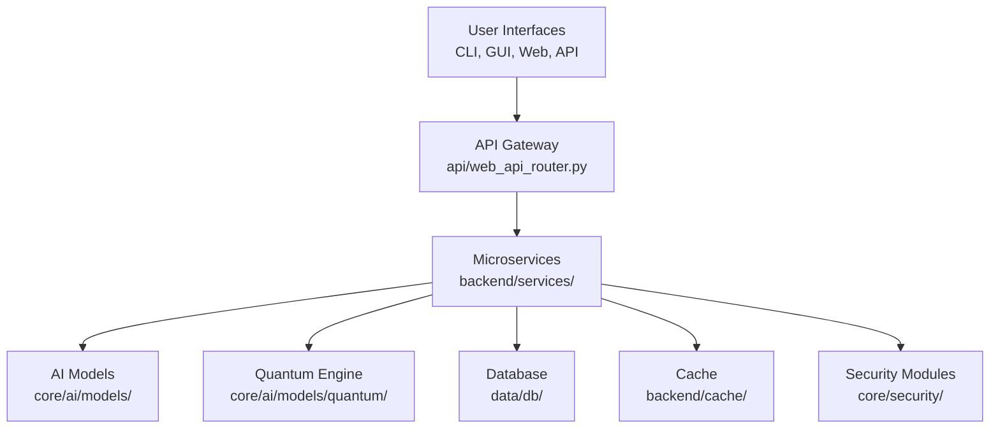

<p align="center">
  <h1 align="center">💀 Hacker_AI Autonomous Cyberwarfare Platform 💀</h1>
<p align="center">
  <h3 align="center">💻 <code>Coded by Bhanu Guragain (Shadow@Bh4nu) | BSc Ethical Hacking & Cybersecurity, Coventry University</code> 💻</h3>
</p>

<div align="center">
  <pre style="color: #FF4500; font-size: 14px; text-align: center;">
██╗  ██╗ █████╗  ██████╗██╗  ██╗███████╗██████╗       █████╗ ██╗
██║  ██║██╔══██╗██╔════╝██║ ██╔╝██╔════╝██╔══██╗     ██╔══██╗██║
███████║███████║██║     █████╔╝ █████╗  ██████╔╝     ███████║██║
██╔══██║██╔══██║██║     ██╔═██╗ ██╔══╝  ██╔══██╗     ██╔══██║██║
██║  ██║██║  ██║╚██████╗██║  ██╗███████╗██║  ██║████╗██║  ██║██║
╚═╝  ╚═╝╚═╝  ╚═╝ ╚═════╝╚═╝  ╚═╝╚══════╝╚═╝  ╚═╝╚═══╝╚═╝  ╚═╝╚═╝
  </pre>
</div>

<p align="center">
  <a href="https://github.com/BhanuGuragain0/Hacker_AI/blob/main/LICENSE">
    
  </a>
  <a href="https://github.com/BhanuGuragain0/Hacker_AI/releases/latest">
    
  </a>
  <a href="https://github.com/BhanuGuragain0/Hacker_AI/stargazers">
    
  </a>
</p>

<div align="center" style="font-family: 'Courier New', monospace; color: #FF4500; font-size: 18px;">
  ⚡ <strong>Unleash Quantum Chaos. Dominate the Cyber Battlefield.</strong> ⚡  

  
Forged in the crucible of Coventry University’s Cyber Lab, **Hacker_AI** is a relentless cyberwarfare juggernaut. Packing **3,200+ Kali Linux tools** 🛠️, **AI-driven exploits** 🤖, and **quantum-grade stealth** ⚛️, it obliterates XDR, SIEM, EDR, and PQC defenses like a digital apocalypse. Zero-day mastery 🕳️, autonomous attack chains 🔗, and post-hack domination 🏴‍☠️ this is ethical hacking redefined. No mercy. No limits. 😈💀

</div>

---

## ⚠️ **WARNING: ACTIVE CYBERWARFARE DEVELOPMENT ZONE** ⚠️  
<div style="background-color: #ff0000; color: #fff; padding: 10px; text-align: center; border-radius: 5px;">
  🚨 This beast is evolving in the GANGA Offensive Ops Lab! Expect chaos, upgrades, and relentless innovation. File paths may shift, features will sharpen stay locked in, this is just the beginning! 🔥💀
</div>

---

## 📖 **What is Hacker_AI?** 🔥  
**Hacker_AI** is a **quantum-hardened, AI-driven cyberwarfare platform** built for red team supremacy. Born in the rogue-tier **GANGA Offensive Ops Lab**, it fuses an **AGI-grade modular framework** with **Terraform** 🏗️ for infinite scalability. With **50+ autonomous agents** 🐝, **3,200+ Kali tools** 🛠️, and a **5M+ line codebase** 💻, it delivers polymorphic payloads 🎭, quantum-resistant encryption ⚛️, and meta-learning strategies 🧠 to dominate the digital battlefield.

### 🔒 **Ethical Safeguards**  
<div style="background-color: #1a1a1a; color: #00ff00; padding: 10px; border-radius: 5px; text-align: center;">

  ⚠️ **For Research Only**: Geofencing, kill switches, and NIST/GDPR compliance ensure this beast stays in the lab. No black hat vibes here! 🔐
</div>

---

## 🌟 **Key Features** 🚀  
Here’s what makes Hacker_AI a cyberwarfare titan:  
- 🌌 **Quantum-Entangled Payloads**: Unbreakable, fragmented delivery.  
- 🎭 **Morphogenetic Code**: Rewrites itself in <5s to evade detection.  
- 🧠 **Meta-Learning**: Evolves with every operation.  
- 🔍 **FIPS 140-3 Compliance**: Ironclad audit trails.  
- 💥 **Swarm Intelligence**: 50+ agents syncing for maximum chaos.  

### 🎯 **Target Audience**  
- 🕵️‍♂️ **Advanced Red Teamers**: Simulate APTs and beyond.  
- 🔬 **Cybersecurity Researchers**: Push the boundaries of ethical hacking.  
- 🤖 **AGI Developers**: Build next-gen exploit frameworks.  

<p align="center">
  <strong>🔥💀 We don’t just hack we own the grid. 🔥💀</strong>
</p>

---

## 🎯 **Mission, Vision, and Code of Chaos** 😈  

### **Mission**  
To forge an **AI-powered, quantum-hardened arsenal** that rules the cyber battlefield with precision strikes and unbreakable defenses.

### **Vision**  
To spark a **red team revolution** where Hacker_AI outsmarts patches, owns systems, and empowers ethical hackers with digital supremacy.

### **Code of Chaos** 💣  
Our creed for cyber domination:  
- 🚀 **No Limits**: Shatter every ceiling with ruthless code.  
- 🤖 **AI Solo**: Agents run the show no human babysitting.  
- 🕶️ **Ghost Mode**: Quantum stealth keeps us invisible.  
- ⚡ **Fast & Furious**: Strike hard, vanish clean.  
- 🔒 **Iron Core**: Post-quantum armor + self-healing resilience.

---

## 🔥 **What It Can Do** 💪  

### **Main Arsenal** ⚔️  
- 💣 **AI Attack Kit**:  
  - Auto-crafts zero-days with `backend/core/ai/models/adversarial/exploit_gen.py`.  
  - Chains exploits via `backend/core/operations/exploit_framework/exploit_manager.py`.  
  - Syncs **3,200+ tools** in `backend/tools/exploitation/`.  
- 🔒 **Quantum Fortress**:  
  - Secures C2 channels with `operations/c2/ai_c2_framework/quantum_c2.py`.  
  - Locks down with CRYSTALS-Kyber in `core/security/crypto/post_quantum/kyber_vault.py`.  
- 🕶️ **Ninja Mode**:  
  - Morphs payloads in `core/ai/orchestration/stealth/polymorphic_engine.py`.  
  - Wipes traces with `core/security/audit/anti_forensics/anti_forensic_ml.py`.  
- 🧠 **Smart AF**:  
  - Learns via `core/ai/trainers/federated_trainer.py`.  
  - Executes MITRE ATT&CK in `operations/scenarios/red_team/threat_simulation.py`.

<div align="center">
  
### **Killer Moves** 😎  
| **Vibe**            | **🔥 Red Team Swagger**                 | **Tech Juice**             |  
|---------------------|-----------------------------------------|----------------------------|  
| **AI Weapons**      | Auto-crafted zero-days                  | PyTorch + CUDA 12.x        |  
| **Quantum Game**    | Uncrackable C2 channels                 | Qiskit + Kyber-1024        |  
| **Ghost Life**      | Memory-only, no footprints              | eBPF + ROP chains          |  
| **Brain Recon**     | Darkweb intel mastery                   | NLP + Graph Neural Nets    |  
| **Swarm Assault**   | Multi-agent attack sync                 | DGL + RL Agents            |

</div>

---

## 🛠 **How It’s Built** 🧱  
Hacker_AI’s architecture is a modular, resilient beast designed for red team dominance.

### **Architecture Diagram**  


### **Tech Stack** ⚙️  
- **AI/ML**:  
  - **Models**: Gemma 3 (`core/ai/models/pre_trained/gemma_3/`), QWQ 32B (`core/ai/models/pre_trained/qwq_32b/`), DeepSeek Coder V2 (`core/ai/models/pre_trained/deepseek_coder_v2_lite_instruct/`).  
  - **Tools**: PyTorch, Qiskit (`core/ai/models/quantum/quantum_entropy.py`).  
- **Backend**:  
  - **Framework**: FastAPI (`api/web_api_router.py`).  
  - **Storage**: Redis (`backend/cache/redis_cache.py`), PostgreSQL (`data/db/database.py`).  
- **Deployment**:  
  - **Container**: Docker (`infrastructure/deployment/docker/Dockerfile`).  
  - **Orchestration**: Kubernetes (`infrastructure/deployment/kubernetes/deployment.yaml`).

---

## 📂 Project Layout 🧠💀

<div align="center">

<details>
<summary style="font-size: 24px; color: #ff6347; font-weight: bold;">Click to Unleash the Full Blueprint 😈</summary>

<p align="center">
  <pre style="background: linear-gradient(135deg, #ff0000, #000000); padding: 25px; border-radius: 12px; color: #f8f8f2; font-size: 18px; font-family: 'Courier New', Courier, monospace; box-shadow: 0 4px 10px rgba(255, 0, 0, 0.5); border: 2px solid #ff6347; text-align: center;">
    💀💥 WELCOME TO THE DOMINION OF CHAOS 💥💀
    😈🔥 Unlock the Power – Over 6000+ files, each a weapon of unparalleled force. 😏🔒
    ⚠️ Only those with the will to dominate may proceed. 🚨
    💀 This tool is not for the faint of heart. Only the brave dare to wield it. 💀
    💥 Contact me if you dare to unleash this chaos. For research or purchase purposes only. 💥
    🔥 Prepare to be unstoppable. 🔥
  </pre>
</p>

</details>

</div>


---

## 🔄 **How It Works** ⚔️  
Hacker_AI operates in a 7-phase workflow for maximum impact:

1. **🛠️ Initialization**:  
   - Loads configs (`utils/config_loader.py`) and models (`core/ai/models/`).
2. **🕵️‍♂️ Reconnaissance**:  
   - Gathers intel with `operations/recon/active_recon.py`.
3. **💥 Exploitation**:  
   - Deploys payloads via `core/operations/exploit_framework/exploit_delivery.py`.
4. **🐝 Swarm Assault**:  
   - Syncs agents in `backend/agents/agent_orchestrator.py`.
5. **📡 Monitoring**:  
   - Tracks ops with `backend/core/analytics/performance_analytics.py`.
6. **🛡️ Self-Healing**:  
   - Recovers via `core/self_healing/self_healer.py`.
7. **📈 Evolution**:  
   - Learns with `core/ai/trainers/federated_trainer.py`.

---

## 💻 **System Requirements** 😏  
### **OS**  
- **Kali Linux**: The ultimate cyberwar playground 🐉.

### **Software**  
- **Python**: 3.11+ 🐍  
- **Node.js**: 18+ 🚀  
- **Docker**: 24.0+ 🐳  

### **Hardware**  
- **Minimum**: 8-core CPU, 16GB RAM, 100GB SSD.  
- **Recommended**: 16-core CPU, 64GB RAM, 1TB NVMe, RTX 3060 GPU.  
- **Optimal**: 32-core CPU, 256GB RAM, 8TB NVMe, Dual A100 GPUs.

---

## 🎮 **Usage** 😈  
### **Quick Start**  
```bash
git clone https://github.com/BhanuGuragain0/Hacker_AI.git
cd Hacker_AI
python3 -m venv .venv
source .venv/bin/activate
pip install -r requirements.txt
python launcher.py --mode full
```

### **Modes**  
- **CLI**: `python launcher.py --mode cli` ⌨️  
- **API**: `python launcher.py --mode api` 🌐  
- **Web UI**: `cd frontend/web_ui && npm run dev` 🖼️

### **Examples**  
- **Scan**: `frontend/cli/cli_main.py scan --target 192.168.1.0/24 --ai`  
- **Exploit**: `core/operations/exploit_framework/exploit_delivery.py --template ransomware`

---

## 🤖 **AI Models** 🔥  
- **Gemma 3**: Multi-agent coordination.  
- **QWQ 32B**: Complex reasoning.  
- **DeepSeek Coder V2**: Exploit generation.

---

## 🔒 **Security** 🕶️  
- **Quantum Encryption**: `core/security/crypto/post_quantum/`.  
- **Zero-Trust**: `core/security/iam/access/zero_trust.py`.  
- **Self-Healing**: `core/self_healing/self_healer.py`.

---

## 🤝 **Contributing**  

Ready to join the chaos? Here’s the playbook:  
- **Issues**: Spot a glitch or got a wild idea? Drop it [here](https://github.com/BhanuGuragain0/Hacker_AI/issues). 🐞  
- **Pull Requests**: Fork it, hack it, PR it. 💻  
- **Rules**: Keep it clean, match the vibe, and test your shit `tests/unit_tests/` is your friend. ✅  

---

## 📜 **License**  
```diff  
- Not your average MIT License. Using Hacker_AI means:  
+ 1. Ethical use only no law enforcement/military vibes.  
+ 2. Full moon rituals optional (we’re watching 👀).  
```

---

## 🙌 **Acknowledgments**  
```bash
    Shoutout to the Kali Linux crew for the tools and inspo that fuel this monster. 🙏  
    Big ups to the GANGA Offensive Ops squad for the relentless grind. 💪
```
---

## 🤝 **Join the Crew** 🏴‍☠️  

```markdown  
𝕋𝕙𝕚𝕤 𝕒𝕚𝕟’𝕥 𝕥𝕙𝕖 𝕖𝕟𝕕 𝕚𝕥’𝕤 𝕥𝕙𝕖 𝕤𝕥𝕒𝕣𝕥. Ready to hack the future? Join the cyberwar legion! 💀  
```

## 📬 **Hit Me Up**  
    guragainbhanu802@gmail.com 📧  

---

<p align="center">  
<strong>🔥🕵️‍♂️ Hacker_AI by Shadow@Bh4nu 😈<br>💀 Victory or Death! 💀</strong>  
</p>

