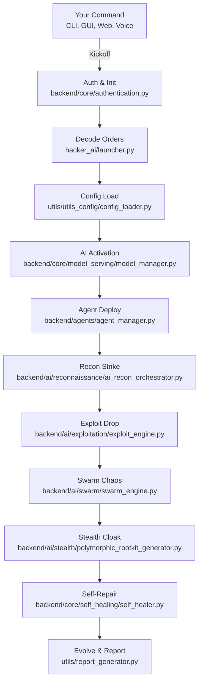

<p align="center">
  <h1 align="center">💀 Hacker_AI Autonomous Cyberwarfare Platform 💀</h1>
<p align="center">
  <h3 align="center">💻 <code>Coded by Bhanu Guragain (Shadow@Bh4nu) | BSc Ethical Hacking & Cybersecurity, Coventry University</code> 💻</h3>
</p>

<div align="center">
  <pre style="display: inline-block; color: #FF4500; font-size: 14px;">
██╗  ██╗ █████╗  ██████╗██╗  ██╗███████╗██████╗       █████╗ ██╗
██║  ██║██╔══██╗██╔════╝██║ ██╔╝██╔════╝██╔══██╗     ██╔══██╗██║
███████║███████║██║     █████╔╝ █████╗  ██████╔╝     ███████║██║
██╔══██║██╔══██║██║     ██╔═██╗ ██╔══╝  ██╔══██╗     ██╔══██║██║
██║  ██║██║  ██║╚██████╗██║  ██╗███████╗██║  ██║████╗██║  ██║██║
╚═╝  ╚═╝╚═╝  ╚═╝ ╚═════╝╚═╝  ╚═╝╚══════╝╚═╝  ╚═╝╚═══╝╚═╝  ╚═╝╚═╝
  </pre>
</div>

<p align="center">
  <a href="https://github.com/BhanuGuragain0/Hacker_AI/blob/main/LICENSE">
    
  </a>
  <a href="https://github.com/BhanuGuragain0/Hacker_AI/releases/latest">
    
  </a>
  <a href="https://github.com/BhanuGuragain0/Hacker_AI/stargazers">
    
  </a>
</p>

<div align="center" style="font-family: 'Courier New', monospace; color: #FF4500; font-size: 18px;">
  
⚡ Forged in the dark crucible of Coventry University’s Cyber Lab, **Hacker_AI** is the ultimate cyberwar juggernaut. 🕶️💣      Packing **3,200+ Kali Linux tools** 🛠️🐉, **AI-driven exploit chaos** 🤖💥, and **quantum-grade stealth** ⚛️🛡️, it obliterates XDR, SIEM, EDR, and PQC 🔍🔥🔒 like a digital apocalypse.      Zero-day mastery 🕳️🎯, post-hack domination 🏴‍☠️🚀, and autonomous attack chains 🔗🤖 it’s win or wipeout. 💀🏆 No mercy. No limits. 😈🔥

</div>

---

⚠️ **Hacker_AI is under active development** ⚠️ this beast is still sharpening its claws in the GANGA Offensive Ops Lab. Expect evolving features, shifting filepaths, and relentless upgrades as we push the boundaries of cyberwarfare. Stay locked in this is just the beginning! 🔥💀


---

## 📖 **What’s Hacker_AI?** 🔥

🚀 **Hacker_AI** is a **DIGITAL SUPREMACY-GRADE** autonomous cyberwarfare platform, birthed in the rogue-tier **GANGA Offensive Ops Lab** 🧪. It fuses an **AGI-grade modular framework** with **Terraform** 🏗️ for infinite scalability, wielding **quantum-resistant AI models** (e.g., `Gemma 3`, `QWQ 32B`, `DeepSeek Coder V2`, `VulnBERT` 🧠), **CRYSTALS-Kyber cryptography** ⚛️, and **3,200+ Kali tools** 🛠️ across a monstrous **5M+ line codebase** 💻. With **50+ AI agents** 🐝, **GAN-polymorphic payloads** 🕶️, and **meta-learning strategies**, it dominates APTs, XDR/SIEM/EDR, and PQC with surgical precision 💣.

---

<div align="center">

### 🔒 **Ethical Safeguards**: Geofencing, kill switches, and NIST/GDPR compliance lock it down for **red team research and education only** no black hat bullshit here. ⚠️

</div>

---

### **Key Features** 🔥  
- 🌌 **Quantum-Entangled Payloads**: Fragmented, unbreakable delivery.  
- 🎭 **Morphogenetic Code**: Rewrites itself to dodge defenses in <5s.  
- 🧠 **Meta-Learning**: Evolves autonomously with every op.  
- 🔍 **FIPS 140-3 Compliance**: Audit trails that don’t fuck around.  
- 💥 **Swarm Intelligence**: 50+ agents syncing for chaos.  

### **Target Audience** 🎯  
- 🕵️‍♂️ Advanced red team simulations.  
- 🔬 Cybersecurity research & education.  
- 🤖 AGI-driven exploit development.  

<p align="center">
  <strong>🔥💀 We don’t navigate. We fucking own the grid. 🔥💀</strong>
</p>

---

## 🎯 **Why It Exists & Where It’s Headed** 🚀

### **Mission**  
To forge an AI-powered, quantum-hardened arsenal that rules the cyber battlefield with precision strikes and unbreakable defenses.

### **Vision**  
To ignite a red team revolution where **Hacker_AI** outsmarts patches, owns systems, and hands ethical hackers the keys to digital supremacy.

- ⚡ **Zero-Lag Hunting**: Threats die before they blink.  
- 🔐 **Quantum Shields**: Kyber-1024 + AES-256-GCM = unhackable AF.  
- 🧠 **Evolving AI**: 32B+ parameter models that adapt and conquer.  
- 🎮 **Your Rules**: CLI, Web UI, Voice, or API control it your way.

### **Red Team Code of Chaos** 😈  
We don’t play nice. Here’s the creed:  
- 🚀 **No Limits**: Code that shatters every ceiling.  
- 🤖 **AI Solo**: Agents run the show no babysitting.  
- 🕶️ **Ghost Mode**: Quantum stealth keeps us invisible.  
- ⚡ **Fast & Furious**: Hit hard, vanish clean.  
- 🔒 **Iron Core**: Post-quantum armor + self-healing grit.

---

## 🔥 **What It Can Do** 💣

### **Core Powers** ⚡  
- 🔐 **Quantum-Proof Locks**: Unbreakable encryption in `backend/quantum_engine/kyber_vault.py`.  
- 🎛️ **AI Command Hub**: Chaos orchestration via `backend/core/orchestration/orchestration_engine.py`.  
- 🩺 **Self-Fixing Beast**: Auto-repairs with `backend/core/self_healing/self_healer.py`.  
- 🚪 **Zero-Trust Wall**: Locks down trust in `backend/core/security/access/zero_trust.py`.  
- 🐝 **Agent Swarm**: Modular ops in `backend/agents/base_agent.py`.  
- 🎮 **Control Freak**: CLI (`frontend/cli/cli_main.py`), GUI (`frontend/gui/gui_main.py`), Web UI (`frontend/web_ui/web_server.py`), API (`backend/api/api_server.py`).

<div align="center">

### **Killer Moves** 😎  
| **Vibe**            | **🔥 Red Team Swagger**                 | **Tech Juice**             |  
|---------------------|-----------------------------------------|----------------------------|  
| **AI Weapons**      | Auto-crafted zero-days                  | PyTorch + CUDA 12.x        |  
| **Quantum Game**    | Uncrackable C2 channels                 | Qiskit + Kyber-1024        |  
| **Ghost Life**      | Memory-only, no footprints              | eBPF + ROP chains          |  
| **Brain Recon**     | Darkweb intel mastery                   | NLP + Graph Neural Nets    |  
| **Voice Boss**      | Voice-activated chaos                   | Qwen2-Audio-7B             |  
| **Swarm Assault**   | Multi-agent attack sync                 | DGL + RL Agents            |  

</div>

### **Main Arsenal** 💪  
- 💣 **AI Attack Kit**:  
  - Syncs **3,200+ tools** via `infrastructure/tools/tool_orchestrator.py`.  
  - Crafts zero-days with `backend/ai/adversarial/zero_day/exploit_synthesizer.py`.  
  - Chains exploits live in `backend/ai/exploitation/exploit_engine.py`.  
- 🔒 **Quantum Fortress**:  
  - Secures C2 with `backend/quantum_engine/quantum_c2.py`.  
  - Locks it down with lattice crypto in `backend/quantum_engine/kyber_vault.py`.  
- 🕶️ **Ninja Mode**:  
  - Morphs payloads via `backend/ai/stealth/polymorphic_rootkit_generator.py`.  
  - Wipes tracks with `backend/ai/stealth/anti_forensic_ml.py`.  
- 🧠 **Smart AF**:  
  - Learns federated-style in `backend/ai/trainers/federated_trainer.py`.  
  - Executes MITRE ATT&CK moves in `backend/ops/red_team/threat_simulation.py`.  

### **Recon Superpowers** 🕵️‍♂️  
- ⚡ **Speed Scans**: Multi-threaded recon in `backend/agents/recon_agent.py`.  
- 🛡️ **Rate Control**: Throttled by `backend/api/middleware/rate_limiter.py`.  
- 💾 **Cache Mastery**: TTL caching in `backend/cache/redis_cache.py`.  
- 🧠 **AI Smarts**: Risk scoring via `backend/ai/vulnerability/vuln_classifier.py`.  
- 🚨 **Crash-Proof**: Fallbacks in `exceptions/custom_exceptions.py`.  
- 📈 **Metrics**: Tracked with `utils/metrics_collector.py`.

---

## 🛠 **How It’s Built** 🧱

Hacker_AI’s architecture is a red team wet dream modular, resilient, and fucking ruthless:

- **QwQ_32B Brain**: Powers AI in `backend/core/model_serving/qwq_32b/qwq_32b.py`. 🧠  
- **Quantum Chaos**: Entropy from `backend/quantum_engine/entropy_generator.py`. ⚛️  
- **Agent Squad**: Flexible agents in `backend/agents/base_agent.py`. 🤖  
- **Self-Fix Magic**: Heals via `backend/core/self_healing/self_healer.py`. 🩺  
- **Zero-Trust Guard**: Secures with `backend/core/security/access/zero_trust.py`. 🔒  

### **Tech Stack** ⚙️  
- **AI/ML Vibes**:  
  - **Models**: Gemma 3 (`backend/core/model_serving/gemma_3/gemma_3.py`), QWQ-32B, DeepSeek Coder V2.  
  - **Tools**: PyTorch (CUDA 12.x), Qiskit (`backend/quantum_engine/quantum_orchestrator.py`).  
  - **Frameworks**: DGL, TensorFlow Quantum.  
- **Backend Buzz**:  
  - **Run It**: FastAPI (`backend/api/api_server.py`), Kafka (`backend/messaging/kafka_handler.py`).  
  - **Store It**: Redis (`backend/cache/redis_cache.py`), PostgreSQL (`data/db/database.py`).  
  - **Lock It**: eBPF in `backend/core/security/ebpf_monitor.py`.  
- **Deploy Game**:  
  - **Box It**: Docker (`infrastructure/deployment/docker/Dockerfile`).  
  - **Scale It**: Kubernetes (`infrastructure/deployment/k8s/deployment.yaml`).  
  - **Watch It**: Prometheus (`infrastructure/monitoring/prometheus_config.yml`).  

### **Recon Crew** 🕵️  
- **Scout**: `backend/agents/recon_agent.py`.  
- **Think**: `backend/ai/reconnaissance/network_mapper.py`.  
- **Setup**: `backend/agents/agent_manager.py`.  
- **Load**: `utils/utils_config/config_loader.py`.  
- **Log**: `utils/logger.py`.

---

## 📂 Project Layout 🧠💀

<div align="center">

<details>
<summary style="font-size: 24px; color: #ff6347; font-weight: bold;">Click to Unleash the Full Blueprint 😈</summary>

<p align="center">
  <pre style="background: linear-gradient(135deg, #ff0000, #000000); padding: 25px; border-radius: 12px; color: #f8f8f2; font-size: 18px; font-family: 'Courier New', Courier, monospace; box-shadow: 0 4px 10px rgba(255, 0, 0, 0.5); border: 2px solid #ff6347; text-align: center;">
    💀💥 WELCOME TO THE DOMINION OF CHAOS 💥💀
    😈🔥 Unlock the Power – Over 6000+ files, each a weapon of unparalleled force. 😏🔒
    ⚠️ Only those with the will to dominate may proceed. 🚨
    💀 This tool is not for the faint of heart. Only the brave dare to wield it. 💀
    💥 Contact me if you dare to unleash this chaos. For research or purchase purposes only. 💥
    🔥 Prepare to be unstoppable. 🔥
  </pre>
</p>

</details>

</div>

---

## 🔄 **How It Rolls** ⚔️

Hacker_AI’s workflow is a seven-phase assault plan because six wasn’t savage enough:

1. **🛠️ Phase 1: Boot Up**  
   - **Goal**: Initialize interfaces, load models, and lock down security.  
   - **Key Files**:  
     - `hacker_ai/launcher.py` 🚀  
     - `utils/utils_config/config_loader.py` ⚙️  
     - `backend/core/model_serving/gemma_3/gemma_3.py` 🧠  
     - `backend/agents/agent_manager.py` 🤖  
     - `backend/core/security/access/access_control.py` 🔑  

2. **🕵️‍♂️ Phase 2: Recon & Plot**  
   - **Goal**: Harvest intel and craft quantum-backed plans.  
   - **Key Files**:  
     - `backend/ai/reconnaissance/ai_recon_orchestrator.py` 🕵️  
     - `infrastructure/tools/information_gathering/nmap_wrapper.py` 📡  
     - `backend/ops/red_team/recon_engine.py` 🧠  

3. **💥 Phase 3: Strike First**  
   - **Goal**: Deploy AI-driven exploits with precision.  
   - **Key Files**:  
     - `backend/ai/exploitation/exploit_engine.py` 💣  
     - `backend/quantum_engine/attacks/quantum_injector.py` ⚛️  
     - `backend/core/orchestration/attack_chains/attack_chain_generator.py` 🔗  

4. **🐝 Phase 4: Swarm Assault**  
   - **Goal**: Unleash coordinated swarm attacks.  
   - **Key Files**:  
     - `backend/ai/swarm/swarm_engine.py` 🐝  
     - `backend/core/orchestration/orchestration_engine.py` 🎻  
     - `backend/agents/swarm_agent.py` 🤖  

5. **📡 Phase 5: Monitor & Adapt**  
   - **Goal**: Track ops and adapt in real-time.  
   - **Key Files**:  
     - `backend/agents/agent_telemetry.py` 📜  
     - `backend/core/analytics/performance_analytics.py` 📈  
     - `utils/metrics_collector.py` 📊  

6. **🛡️ Phase 6: Defend & Recover**  
   - **Goal**: Counter threats and self-heal.  
   - **Key Files**:  
     - `backend/ai/defensive/threat_hunting/threat_mapper.py` 🕵️‍♂️  
     - `backend/core/self_healing/self_healer.py` 🩺  
     - `backend/ai/defensive/ir_automation.py` 🚨  

7. **📈 Phase 7: Learn & Evolve**  
   - **Goal**: Analyze results and level up.  
   - **Key Files**:  
     - `utils/report_generator.py` 📝  
     - `backend/ai/trainers/federated_trainer.py` 🏋️  
     - `backend/ai/optimization/quantum_optimizer.py` 🔮  

---

## 💻 **System Requirements** 😏

### **🛠 Operating System**  
```bash
Kali Linux (🔥 The Beast 😈) - The ultimate cyberwar playground.
```
- **Python**: 3.11+ 🐍  
- **Node.js**: 18+ 🚀  
- **Docker**: 24.0+ 🐳  

### **⚙️ Hardware Requirements**  

#### **Minimum 🥺 (Basic Chaos)**  
```bash
💻 CPU: 8-core (Intel i5/Ryzen 5)  
🧠 RAM: 16GB  
💾 Storage: 100GB SSD  
🖥️ GPU: Optional (but weak sauce)  
```

#### **Recommended 👿 (Pro Pentesting & AI)**  
```bash
💻 CPU: 16-core (Intel i7/Ryzen 7)  
🧠 RAM: 64GB  
💾 Storage: 1TB NVMe SSD  
🖥️ GPU: NVIDIA RTX 3060+ (CUDA 12.x)  
```

#### **God Mode 😈💀 (Cyberwarfare Overlord)**  
```bash
💻 CPU: 32-core (Intel Xeon/AMD EPYC)  
🧠 RAM: 256GB  
💾 Storage: 8TB NVMe SSD  
🖥️ GPU: Dual NVIDIA A100 80GB (CUDA 12.x)  
```

---

## 🎮 **How to Play** 😈

### **🚀 Quick Start**  
1. Clone the chaos:  
   ```bash  
   git clone https://github.com/BhanuGuragain0/Hacker_AI.git  
   cd Hacker_AI  
   ```  
2. Build the lair:  
   ```bash  
   python3 -m venv .venv  
   source .venv/bin/activate  
   pip install -r requirements.txt  
   ```  
3. Unleash the beast:  
   ```bash  
   python hacker_ai/launcher.py --mode full  
   ```

### **⚙️ Full Setup**  
```bash  
# Grab the code  
git clone --depth=1 https://github.com/BhanuGuragain0/Hacker_AI.git  
cd Hacker_AI  

# Setup the environment  
python3 -m venv .venv  
source .venv/bin/activate  # Windows: .venv\Scripts\activate  
pip install -r requirements.txt  

# Launch the chaos  
python hacker_ai/launcher.py  
```

### **🔧 Tweak It**  
- **Runtime**: `config/runtime_config.yaml` ⚙️  
- **Secrets**: `infrastructure/secrets/vault/api_keys.json` 🔑  
- **Recon**: `config/reconnaissance.json` 🕵️  

### **🔥 Modes**  
- **CLI**: `python hacker_ai/launcher.py --mode cli` ⌨️  
- **API**: `python hacker_ai/launcher.py --mode api` 🌐  
- **GUI**: `python hacker_ai/launcher.py --mode gui` 🖼️  
- **Full**: `python hacker_ai/launcher.py --mode full` 💪  

### **💣 Examples**  
- **Net Scan**:  
  ```bash  
  python frontend/cli/cli_main.py scan --target 192.168.1.0/24 --ai  
  ```  
- **Exploit Chain**:  
  ```bash  
  python backend/core/orchestration/attack_chains/attack_chain_generator.py --template ransomware  
  ```  
- **Web Dash**:  
  ```bash  
  cd frontend/web_ui && npm run dev  
  ```  
- **Voice Trigger**:  
  ```bash  
  python backend/core/model_serving/kokoro_82m/kokoro_tts.py --listen  
  # Say: "Initiate Operation Midnight"  
  ```  
- **Recon Run**:  
  ```bash  
  python frontend/cli/cli_main.py recon --target example.com --scan-types dns,whois,subdomains  
  ```  
- **API Hit**:  
  ```bash  
  curl -X POST http://localhost:8000/v1/exploit -H "Content-Type: application/json" -d '{"target": "192.168.1.100"}'  
  ```

### **🕵️‍♂️ Pro Recon API**  
```python  
import asyncio  
from hacker_ai.utils.utils_config.config_loader import ConfigLoader  
from hacker_ai.backend.agents.recon_agent import ReconAgent  

async def run_pro_scan():  
    recon_config = ConfigLoader.load_config("config/reconnaissance.json")  
    agent = ReconAgent(recon_config)  
    await agent.start()  
    try:  
        results = await agent.scan_target(  
            target="example.com",  
            scan_types=["dns", "whois", "shodan", "subdomains"],  
            options={"analyze": True, "bypass_cache": False}  
        )  
        print(f"Got {len(results['scan_types'])} hits! 🎯")  
        if "analysis" in results:  
            print(f"Risk: {results['analysis']['risk_level']} 🚨")  
    finally:  
        await agent.stop()  

asyncio.run(run_pro_scan())  
```

---

## 🤖 **AI Crew** 🔥

Hacker_AI’s AI squad is a lineup of digital assassins:  
- **Gemma 3**: Swarm coordinator (`backend/core/model_serving/gemma_3/gemma_3.py`). 🐝  
- **QWQ 32B**: Reasoning titan (`backend/core/model_serving/qwq_32b/qwq_32b.py`). 🧠  
- **Openthinker 7B/32B**: Pentest maestros (`backend/core/model_serving/openthinker_7b/openthinker_7b.py`). 💻  
- **DeepSeek Coder V2**: Exploit craftsman (`backend/core/model_serving/deepseek_coder_v2_lite_instruct/modeling_deepseek.py`). 💥  
- **Qwen2_5_VL_7B**: Vuln hunter (`backend/core/model_serving/qwen2_5_vl_7b_instruct/qwen2_5_vl.py`). 👁️  
- **SecurityLLM**: Threat overlord (`backend/core/model_serving/securityllm/securityllm.py`). 🔒  
- **Qwen2-Audio-7B**: Voice chaos maker (`backend/core/model_serving/qwen2_audio_7b_instruct/qwen2_audio.py`). 🎤  

---

## 🔒 **Stay Safe, Homie** 🕶️

- **Quantum Locks**: Kyber-1024 + AES-256-GCM in `backend/quantum_engine/kyber_vault.py`. 🔐  
- **Zero-Trust**: Ironclad checks in `backend/core/security/access/zero_trust.py`. 🚪  
- **Self-Heal**: Auto-recovery via `backend/core/self_healing/self_healer.py`. 🩺  
- **Shape-Shifters**: Polymorphic stealth in `backend/ai/stealth/polymorphic_rootkit_generator.py`. 🎭  
- **No Tracks**: Forensic wipe with `backend/ai/stealth/anti_forensic_ml.py`. 🧹  

**Pro Tips**:  
- Lock keys in `infrastructure/secrets/vault/api_keys.json`. 🔑  
- Tweak limits with `backend/api/middleware/rate_limiter.py`. ⚖️  
- Proxy recon via `backend/ai/exploitation/tor_proxy.py`. 🌐  
- Encrypt loot with `backend/core/security/crypto/encryption.py`. 🔍  

---

## 🔄 **Workflow Map** 🗺️



---

## 🤝 **Contributing**  

Ready to join the chaos? Here’s the playbook:  
- **Issues**: Spot a glitch or got a wild idea? Drop it [here](https://github.com/BhanuGuragain0/Hacker_AI/issues). 🐞  
- **Pull Requests**: Fork it, hack it, PR it. 💻  
- **Rules**: Keep it clean, match the vibe, and test your shit `tests/unit_tests/` is your friend. ✅  

---

## 📜 **License**  
```diff  
- Not your average MIT License. Using Hacker_AI means:  
+ 1. Ethical use only no law enforcement/military vibes.  
+ 2. Full moon rituals optional (we’re watching 👀).  
```

---

## 🙌 **Acknowledgments**  
```bash
    Shoutout to the Kali Linux crew for the tools and inspo that fuel this monster. 🙏  
    Big ups to the GANGA Offensive Ops squad for the relentless grind. 💪
```
---

## 🤝 **Join the Crew** 🏴‍☠️  

```markdown  
𝕋𝕙𝕚𝕤 𝕒𝕚𝕟’𝕥 𝕥𝕙𝕖 𝕖𝕟𝕕 𝕚𝕥’𝕤 𝕥𝕙𝕖 𝕤𝕥𝕒𝕣𝕥. Ready to hack the future? Join the cyberwar legion! 💀  
```

## 📬 **Hit Me Up**  
    guragainbhanu802@gmail.com 📧  

---

<p align="center">  
<strong>🔥🕵️‍♂️ Hacker_AI by Shadow@Bh4nu 😈<br>💀 Victory or Death! 💀</strong>  
</p>

