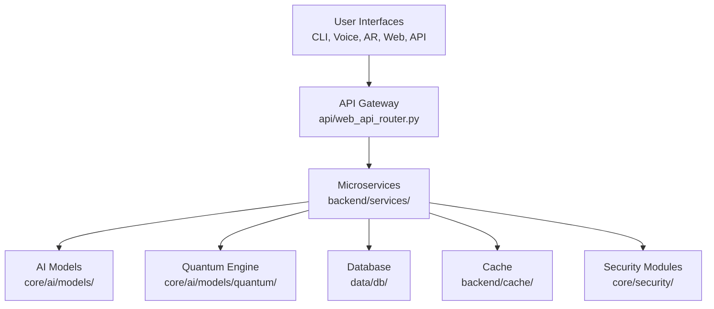

<p align="center">
  <h1 align="center">💀 Hacker_AI Autonomous Cyberwarfare Platform 💀</h1>
  <h3 align="center">💻 <code>Coded by Bhanu Guragain (Shadow@Bh4nu) | BSc Ethical Hacking & Cybersecurity, Coventry University</code> 💻</h3>
</p>

<div align="center">
  <pre style="color: #FF4500; font-size: 14px; text-align: center;">
██╗  ██╗ █████╗  ██████╗██╗  ██╗███████╗██████╗       █████╗ ██╗
██║  ██║██╔══██╗██╔════╝██║ ██╔╝██╔════╝██╔══██╗     ██╔══██╗██║
███████║███████║██║     █████╔╝ █████╗  ██████╔╝     ███████║██║
██╔══██║██╔══██║██║     ██╔═██╗ ██╔══╝  ██╔══██╗     ██╔══██║██║
██║  ██║██║  ██║╚██████╗██║  ██╗███████╗██║  ██║████╗██║  ██║██║
╚═╝  ╚═╝╚═╝  ╚═╝ ╚═════╝╚═╝  ╚═╝╚══════╝╚═╝  ╚═╝╚═══╝╚═╝  ╚═╝╚═╝
  </pre>
</div>

<p align="center">
  <a href="https://github.com/BhanuGuragain0/Hacker_AI/blob/main/LICENSE">
    
  </a>
  <a href="https://github.com/BhanuGuragain0/Hacker_AI/releases/latest">
    
  </a>
  <a href="https://github.com/BhanuGuragain0/Hacker_AI/stargazers">
    
  </a>
</p>

<div align="center" style="font-family: 'Courier New', monospace; color: #FF4500; font-size: 18px;">
  ⚡ <strong>Unleash Quantum Chaos. Dominate the Cyber Battlefield.</strong> ⚡  
  <br>  
  
Forged in the fiery crucible of Coventry University’s Cyber Lab 🔥🧪, **Hacker_AI** is a relentless cyberwarfare juggernaut. Wielding **3,200+ Kali Linux tools** 🛠️, **AI-driven exploits** 🤖, **quantum-grade stealth** ⚛️, **voice-driven control** 🎙️, and **AR-enhanced visuals** 🕶️, it obliterates XDR, SIEM, EDR, and PQC defenses like a digital apocalypse 💥. Zero-day mastery 🕳️, autonomous attack chains 🔗, and post-hack domination 🏴‍☠️ this is ethical hacking redefined. No mercy. No limits. 😈💀
</div>

---

## ⚠️ **WARNING: ACTIVE CYBERWARFARE DEVELOPMENT ZONE** ⚠️  
<div style="background-color: #ff0000; color: #fff; padding: 10px; text-align: center; border-radius: 5px;">
  🚨 This beast is evolving in the GANGA Offensive Ops Lab! Expect chaos 🌩️, upgrades ⚙️, and relentless innovation 🔥. File paths may shift, features will sharpen stay locked in, this is just the beginning! 💀⚡
</div>

---

## 📖 **What is Hacker_AI?** 🔥  
**Hacker_AI** is a **quantum-hardened, AI-driven cyberwarfare platform** built for red team supremacy. Born in the rogue-tier **GANGA Offensive Ops Lab** 🏴, it fuses an **AGI-grade modular framework** with **Terraform** 🏗️ for infinite scalability. Packing **50+ autonomous agents** 🐝, **3,200+ Kali tools** 🛠️, and a **5M+ line codebase** 💻, it delivers **polymorphic payloads** 🎭, **quantum-resistant encryption** ⚛️, **voice command control** 🎙️, **AR visualization** 🕶️, and **meta-learning strategies** 🧠 to own the digital battlefield.

### 🔒 **Ethical Safeguards**  
<div style="background-color: #1a1a1a; color: #00ff00; padding: 10px; border-radius: 5px; text-align: center;">
  
  ⚠️ **For Research Only**: Geofencing 🌍, kill switches ⏹️, voice/AR disclaimers 🎤🕶️, and NIST/GDPR compliance 🔐 keep this titan lab-locked. No black hat vibes just pure red team science! 🧪💀
</div>

---

## 🌟 **Key Features** 🚀  
Here’s what makes Hacker_AI a cyberwarfare god:  
- 🌌 **Quantum-Entangled Payloads**: Unbreakable, fragmented chaos ⚛️💣  
- 🎭 **Morphogenetic Code**: Rewrites itself in <5s to ghost defenses 👻  
- 🎙️ **Voice-Driven Control**: Command ops hands-free with NLP 🎤 
- 🕶️ **AR Visualization**: Real-time network topology in augmented reality 🌐 
- 🧠 **Meta-Learning**: Evolves with every strike ⚡  
- 🔍 **FIPS 140-3 Compliance**: Audit trails harder than steel 🛡️  
- 💥 **Swarm Intelligence**: 50+ agents syncing for total domination 🐝  

### 🎯 **Target Audience**  
- 🕵️‍♂️ **Advanced Red Teamers**: Simulate APTs and beyond 🌩️  
- 🔬 **Cybersecurity Researchers**: Push ethical hacking limits 🧪  
- 🤖 **AGI Developers**: Forge next-gen exploit frameworks 💻  

<p align="center">
  <strong>🔥💀 We don’t just hack we fucking own the grid! 🔥💀</strong>
</p>

---

## 🎯 **Mission, Vision, and Code of Chaos** 😈  

### **Mission**  
To forge an **AI-powered, quantum-hardened arsenal** ⚔️ that rules the cyber battlefield with precision strikes and unbreakable defenses.

### **Vision**  
To ignite a **red team revolution** 🔥 where Hacker_AI outsmarts patches, owns systems, and empowers ethical hackers with digital supremacy.

### **Code of Chaos** 💣  
Our creed for cyber domination:  
- 🚀 **No Limits**: Shatter ceilings with ruthless code ⚡  
- 🤖 **AI Solo**: Agents run wild no human babysitting 🐝  
- 🕶️ **Ghost Mode**: Quantum stealth keeps us invisible 👻  
- 🎙️ **Voice of Power**: Control the chaos hands-free ⚙️  
- ⚡ **Fast & Furious**: Strike hard, vanish clean 🌩️  
- 🔒 **Iron Core**: Post-quantum armor + self-healing steel 🛡️  

---

## 🔥 **What It Can Do** 💪  

### **Main Arsenal** ⚔️  
- 💣 **AI Attack Kit**:  
  - Auto-crafts zero-days with `backend/core/ai/models/adversarial/exploit_gen.py` 🕳️  
  - Chains exploits via `backend/core/operations/exploit_framework/exploit_manager.py` 🔗  
  - Syncs **3,200+ tools** in `backend/tools/exploitation/` 🛠️  
- 🔒 **Quantum Fortress**:  
  - Secures C2 with `operations/c2/ai_c2_framework/quantum_c2.py` ⚛️  
  - Locks down with CRYSTALS-Kyber in `core/security/crypto/post_quantum/kyber_vault.py` 🔐 
- 🕶️ **Ninja Mode**:  
  - Morphs payloads in `core/ai/orchestration/stealth/polymorphic_engine.py` 🎭 
  - Wipes traces with `core/security/audit/anti_forensics/anti_forensic_ml.py` 👻  
- 🎙️ **Voice Control**:  
  - Commands via `terminal/voice_commands.py` 🎤 
- 🕶️ **AR Recon**:  
  - Visualizes topology with `terminal/ar_renderer.py` 🌐 
- 🧠 **Smart AF**:  
  - Learns via `core/ai/trainers/federated_trainer.py` ⚡  
  - Executes MITRE ATT&CK in `operations/scenarios/red_team/threat_simulation.py` 🛡️  

<div align="center">
  
### **Killer Moves** 😎 
| **Vibe**            | **🔥 Red Team Swagger**                 | **Tech Juice**             |  
|---------------------|-----------------------------------------|----------------------------|  
| **AI Weapons**      | Auto-crafted zero-days 🕳️             | PyTorch + CUDA 12.x ⚙️    |  
| **Quantum Game**    | Uncrackable C2 channels ⚛️            | Qiskit + Kyber-1024 🔐    |  
| **Ghost Life**      | Memory-only, no footprints 👻          | eBPF + ROP chains 🛠️     |  
| **Voice Command**   | Hands-free chaos control 🎙️           | SpeechRecognition + NLP 🎤|  
| **AR Vision**       | Real-time topology visuals 🕶️         | Three.js + TypeScript 🌐  |  
| **Brain Recon**     | Darkweb intel mastery 🧠              | NLP + Graph Neural Nets ⚡|  
| **Swarm Assault**   | Multi-agent attack sync 🐝            | DGL + RL Agents 🤖        |

</div>

---

## 🛠 **How It’s Built** 🧱  
Hacker_AI’s architecture is a modular, quantum-fueled monster designed for red team dominance.

### **Architecture Diagram**  


### **Tech Stack** ⚙️  
- **AI/ML**:  
  - **Models**: Gemma 3 (`core/ai/models/pre_trained/gemma_3/`), QWQ 32B (`core/ai/models/pre_trained/qwq_32b/`), DeepSeek Coder V2 (`core/ai/models/pre_trained/deepseek_coder_v2_lite_instruct/`) 🤖  
  - **Tools**: PyTorch, Qiskit (`core/ai/models/quantum/quantum_entropy.py`), DGL, Transformers ⚡  
- **Voice & AR**:  
  - **Voice**: `speechrecognition`, `pyaudio` (`terminal/voice_commands.py`) 🎙️  
  - **AR**: Three.js (`frontend/src/lib/`), TypeScript (`frontend/src/components/visualizer.ts`) 🕶️  
- **Backend**:  
  - **Framework**: FastAPI (`api/web_api_router.py`) 🌐 
  - **Storage**: Redis (`backend/cache/redis_cache.py`), PostgreSQL (`data/db/database.py`) 💾  
- **Deployment**:  
  - **Container**: Docker (`infrastructure/deployment/docker/Dockerfile`) 🐳 
  - **Orchestration**: Kubernetes (`infrastructure/deployment/kubernetes/deployment.yaml`) ☸️  

---

## 📂 **Project Layout** 🧠💀  
<div align="center">

<details>
<summary style="font-size: 24px; color: #ff6347; font-weight: bold;">Click to Unleash the Full Blueprint 😈</summary>

<p align="center">
  <pre style="background: linear-gradient(135deg, #ff0000, #000000); padding: 25px; border-radius: 12px; color: #f8f8f2; font-size: 18px; font-family: 'Courier New', Courier, monospace; box-shadow: 0 4px 10px rgba(255, 0, 0, 0.5); border: 2px solid #ff6347; text-align: center;">
    💀💥 WELCOME TO THE DOMINION OF CHAOS 💥💀
    😈🔥 Unlock the Power – Over 6000+ files, each a weapon of unparalleled force. 😏🔒
    ⚠️ Only those with the will to dominate may proceed. 🚨
    💀 This tool is not for the faint of heart. Only the brave dare to wield it. 💀
    💥 Contact me if you dare to unleash this chaos. For research or purchase purposes only. 💥
    🔥 Prepare to be unstoppable. 🔥
  </pre>
</p>

</details>

</div>

---

## 🔄 **How It Works** ⚔️  
Hacker_AI operates in a 7-phase workflow for maximum devastation:  

1. **🛠️ Initialization**:  
   - Loads configs (`utils/config_loader.py`) and models (`core/ai/models/`) ⚙️  
2. **🕵️‍♂️ Reconnaissance**:  
   - Gathers intel with `operations/recon/active_recon.py` 🔍 
   - Quantum ML recon via `core/ai/models/quantum/quantum_ml_recon.py` ⚛️  
3. **💥 Exploitation**:  
   - Deploys payloads via `core/operations/exploit_framework/exploit_delivery.py` 💣  
4. **🐝 Swarm Assault**:  
   - Syncs agents in `backend/agents/agent_orchestrator.py` 🤖  
5. **📡 Monitoring**:  
   - Tracks ops with `backend/core/analytics/performance_analytics.py` 📊  
   - Visualizes in AR with `terminal/ar_renderer.py` 🕶️  
6. **🛡️ Self-Healing**:  
   - Recovers via `core/self_healing/self_healer.py` ⚕️  
7. **📈 Evolution**:  
   - Learns with `core/ai/trainers/federated_trainer.py` 🧠  

---

## 💻 **System Requirements** 😏 
### **OS**  
- **Kali Linux**: The ultimate cyberwar playground 🐉 

### **Software**  
- **Python**: 3.11+ 🐍  
- **Node.js**: 18+ 🚀  
- **Docker**: 24.0+ 🐳 

### **Hardware**  
- **Minimum**: 8-core CPU, 16GB RAM, 100GB SSD ⚙️  
- **Recommended**: 16-core CPU, 64GB RAM, 1TB NVMe, RTX 3060 GPU 🎮 
- **Optimal**: 32-core CPU, 256GB RAM, 8TB NVMe, Dual A100 GPUs 💪  

---

## 🎮 **Usage** 😈  
### **Quick Start**  
```bash
git clone https://github.com/BhanuGuragain0/Hacker_AI.git
cd Hacker_AI
python3 -m venv .venv
source .venv/bin/activate
pip install -r requirements.txt
python launcher.py --mode full
```

### **Modes**  
- **CLI**: `python launcher.py --mode cli` ⌨️  
- **Voice**: `python launcher.py --mode voice` 🎙️  
- **AR**: `python launcher.py --mode ar` 🕶️  
- **API**: `python launcher.py --mode api` 🌐 
- **Web UI**: `cd frontend/web_ui && npm run dev` 🖼️  

### **Examples**  
- **Scan**: `frontend/cli/cli_main.py scan --target 192.168.1.0/24 --ai --quantum` 🔍 
- **Exploit**: `core/operations/exploit_framework/exploit_delivery.py --template ransomware` 💣  
- **Voice Recon**: `terminal/voice_commands.py recon --target example.com --quantum` 🎤 
- **AR Visualize**: `terminal/ar_renderer.py visualize --topology results.json` 🕶️  

---

## 🤖 **AI Models** 🔥  
- **Gemma 3**: Multi-agent coordination 🤖  
- **QWQ 32B**: Complex reasoning 🧠  
- **DeepSeek Coder V2**: Exploit generation 💻  
- **VulnBERT**: Zero-day prediction (`core/ai/models/vulnbert/`) 🔍 

---

## 🔒 **Security** 🕶️  
- **Quantum Encryption**: `core/security/crypto/post_quantum/` ⚛️  
- **Zero-Trust**: `core/security/iam/access/zero_trust.py` 🔐 
- **Self-Healing**: `core/self_healing/self_healer.py` ⚕️  
- **Voice Auth**: NLP voiceprint (`terminal/voice_commands.py`) 🎤 

---

## 🤝 **Contributing**  
Ready to join the chaos? Here’s the playbook:  
- **Issues**: Spot a glitch or got a wild idea? Drop it [here](https://github.com/BhanuGuragain0/Hacker_AI/issues) 🐞  
- **Pull Requests**: Fork it, hack it, PR it 💻  
- **Rules**: Keep it clean, match the vibe, test your shit `tests/unit_tests/` is your ally ✅  

---

## 📜 **License**  
```diff  
- Not your average MIT License. Using Hacker_AI means:  
+ 1. Ethical use only no law enforcement/military vibes 🔐 
+ 2. Full moon rituals optional (we’re watching 👀) 🌕  
```

---

## 🙌 **Acknowledgments**  
```bash
    Shoutout to the Kali Linux crew for the tools and inspo that fuel this monster 🙏 
    Big ups to the GANGA Offensive Ops squad for the relentless grind 💪  
    Respect to xAI for the Grok 3 backbone AI chaos unleashed 🤖  
```

---

## 🤝 **Join the Crew** 🏴‍☠️  
```markdown  
𝕋𝕙𝕚𝕤 𝕒𝕚𝕟’𝕥 𝕥𝕙𝕖 𝕖𝕟𝕕 𝕚𝕥’𝕤 𝕥𝕙𝕖 𝕤𝕥𝕒𝕣𝕥. Ready to hack the future? Join the cyberwar legion! 💀  
```

## 📬 **Hit Me Up**  
    guragainbhanu802@gmail.com 📧  

---

<p align="center">  
<strong>🔥🕵️‍♂️ Hacker_AI by Shadow@Bh4nu 😈<br>💀 Victory or Death! 💀</strong>  
</p>

